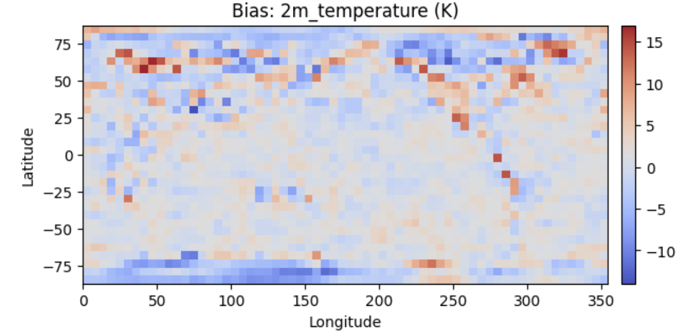
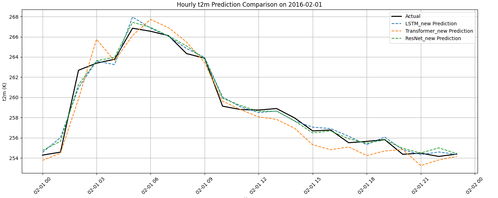
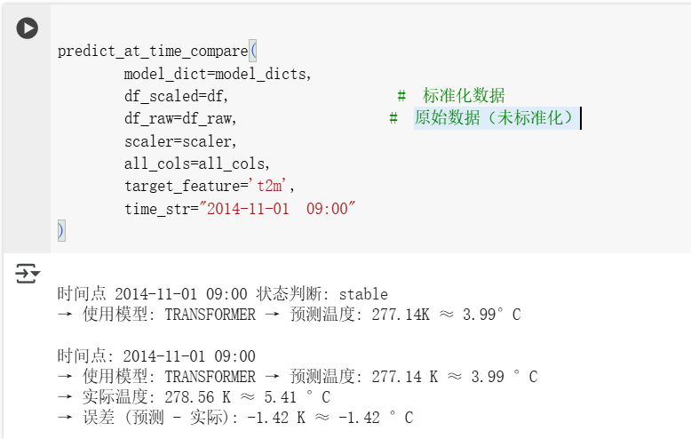

# 气象预测大作业——实验报告

>
> 注：由于答辩时间有限，PPT内容较为简略，以下是具体实验报告 
仓库链接：https://github.com/PiggySusie/Climate-Prediction

##  一、项目背景与研究意义

### 项目概述

本项目的核心目标是优化天气预测模型，使用深度学习方法进行时序预测，尤其专注于不同模型在捕捉天气数据时序特征和周期性规律的表现。为了实现这一目标，我们使用了多种深度学习架构，如LSTM、ResNet和Transformer，并针对时序数据的预测任务进行了创新性优化，尤其是动态模型选择和模型融合策略。

### 关键改进和亮点：

1. **时序数据预测**：
    在项目初期，我们学习了Img2Img和Seq2Img的模型结构，但随着对气象预测需求的深入分析，时序预测成为了项目的核心部分。我们采用了深度学习模型来捕捉天气数据的时序依赖关系，并使用带有自注意力机制的Transformer模型，重点关注如何利用时间和周期性特征（如小时和月份的周期性）来提高预测的准确性。
2. **动态模型选择**：
    针对不同天气状态（如稳定、趋势、拐点），我们引入了动态模型选择机制。当温度变化较小时，我们使用Transformer模型进行预测；当温度发生较大波动时，我们切换到ResNet模型进行更精确的建模；而LSTM模型则在温度变化平稳时发挥其优势。通过这种动态选择，我们能够根据实时的天气数据调整模型，提高预测性能。
3. **模型融合（Meta-Learner）**：
    为了进一步提升预测准确性，我们采用了Meta-Learner模型融合策略。通过将Transformer、LSTM和ResNet模型的预测结果作为输入，利用XGBoost进行学习和优化，最终得到了一个强大的Meta-Learner模型。该模型综合了多个基础模型的优点，并有效地提升了整体预测精度。

### 项目重点：

- **数据准备**：从北京气候数据中提取温度、风速、湿度等特征，并进行了标准化处理和周期性特征的引入（如小时和月份的正弦余弦编码）。

- **深度学习模型**：

  - **LSTM**：处理时间序列数据的经典模型，能够捕捉长期依赖关系。
  - **ResNet**：用于捕捉局部时序变化和复杂的气象特征，特别是在短期内有大波动的情况下表现优秀。
  - **Transformer**：借助自注意力机制，可以捕捉长期和短期的时间依赖，尤其适合处理较长时间跨度的数据。

- **动态模型推理**：基于温度变化的趋势判断（如稳定、趋势、拐点），动态选择最合适的模型进行推理，并使用最新的模型状态进行预测。

- **Meta-Learner**：将多个模型的输出结果作为特征，利用XGBoost训练一个强大的模型进行最终预测，从而提升整体预测性能。

  

## 二、数据源与变量选取

### 2.1 数据来源

本项目所使用的数据来源于 欧洲中期天气预报中心（ECMWF）发布的 ERA5 再分析数据集，该数据集为全球气象研究与建模提供了高质量、时空分辨率高、变量丰富的大气变量信息。为便于深度学习模型的快速加载和处理，本项目使用经过 WeatherBench 项目标准化格式的 ERA5 数据，并通过开源工具库 ClimateLearn 进行下载和预处理。

### 2.2 数据集配置

数据源：ERA5（ECMWF 再分析数据）

获取方式：ClimateLearn 工具库 + WeatherBench 数据结构

空间分辨率：1.40625° × 1.40625° 

时间分辨率：6 小时 / 每帧（Subsample=6）

时间范围：

训练集：1979 - 2014

验证集：2015 - 2016

测试集：2017 - 2018

### 2.3 气象变量选取与建模准备

#### 2.3.1 初步实验阶段变量选取

在初步探索模型结构与基本流程时，按照教学指导，选择了以下 6 个与人体体感直接相关的变量进行建模：

| 变量名称     | ERA5 名称                      | 单位 | 说明                             |
| ------------ | ------------------------------ | ---- | -------------------------------- |
| 2米气温      | `2m_temperature`               | K    | 表面气温，直接影响人体热感       |
| 相对湿度     | `relative_humidity`            | %    | 表示空气湿度，影响舒适度         |
| 总降水量     | `total_precipitation`          | m    | 地表累积降水                     |
| 总云量       | `total_cloud_cover`            | 0–1  | 云层覆盖率，影响光照与降水可能性 |
| 顶层太阳辐射 | `toa_incident_solar_radiation` | W/m² | 太阳入射强度，影响地表热平衡     |
| 涡度         | `vorticity`                    | 1/s  | 空气旋转程度，辅助识别天气系统   |


#### 2.3.2 模型实验阶段变量扩展

在掌握基本流程后，我进一步构建并训练了自己的深度学习模型。为更全面刻画大气结构和动力场信息，项目后期训练阶段选取了更具物理意义的 8 个气象变量，重点关注温度、风场、水汽等影响因素：

```py
var_map = {
    'u10': '10m_u_component_of_wind',
    'v10': '10m_v_component_of_wind',
    't2m': '2m_temperature',
    'z': 'geopotential',
    'q': 'specific_humidity',
    't': 'temperature',
    'u': 'u_component_of_wind',
    'v': 'v_component_of_wind'
}
```

此外，选定北京区域（纬度 39.9°，经度 116.4°）为目标网格点，进行局地序列提取和预测实验。每个变量分别处理后以 `.csv` 格式保存，供后续模型调用。

## 三、ResEet模型初步实验

### 3.1 实验目标与背景说明

为探索空间卷积网络在气象图像预测任务中的表现，本阶段引入经典计算机视觉模型 ResNet（Residual Network）对 ERA5 网格数据进行建模。ResNet 能有效缓解深层网络中的梯度消失问题，具有较强的特征提取能力，尤其适合处理具有明显空间结构的气象图像数据。

本实验以 **2m 温度（`2m_temperature`）**和**降水（total_precipitation）** 变量为例，采用两种预测形式进行模型测试：

| 预测形式 | 含义        | 输入                   | 输出          | 应用示例                          |
| -------- | ----------- | ---------------------- | ------------- | --------------------------------- |
| Img2Img  | 图像 → 图像 | 当前时刻的气象图       | 未来 6 小时图 | 现在温度 → 预测 6h 温度           |
| Seq2Img  | 序列 → 图像 | 过去 3 序间 (合计 18h) | 未来 24h 图   | 输入 18h 温度 → 预测未来 24h 温度 |

### 3.2 ResNet-Seq2Img 模型

#### 3.2.1 基线模型评估

##### 1. 模型测试


第一组（上方）是 `climatology` 模型的测试结果

第二组（下方）是 `persistence` 模型的测试结果

> **RMSE：Root Mean Squared Error（均方根误差）**
>
> 它衡量的是：模型预测值和真实值之间差异的“平均误差大小”
>
> 数学表达：
> $$
> \text{RMSE} = \sqrt{ \frac{1}{n} \sum_{i=1}^{n} (y_i^{\text{pred}} - y_i^{\text{true}})^2 }
> $$
>
>
> RMSE 越小说明模型预测越准确，RMSE 越大则说明模型预测波动越大（偏离真实值多） 

| 指标名                              | 含义                                   |
| ----------------------------------- | -------------------------------------- |
| `test/lat_rmse:2m_temperature`      | 预测的气温（温度）的 RMSE              |
| `test/lat_rmse:total_precipitation` | 预测的降水量的 RMSE                    |
| `test/lat_rmse:aggregate`           | 所有输出变量整体 RMSE 的平均值         |
| `test/lat_acc:*`                    | 纬向相关系数（相关性越高说明预测越好） |


结果对比：

| 模型类型        | 气温 RMSE ↓ | 降水 RMSE ↓ | 平均 RMSE ↓ | 气温相关 ↑ | 降水相关 ↑ | 平均相关 ↑ |
| --------------- | ----------- | ----------- | ----------- | ---------- | ---------- | ---------- |
| **Climatology** | 5.83        | 0.50        | 3.16        | ≈0         | ≈0         | ≈0         |
| **Persistence** | 2.12        | 0.61        | 1.36        | 0.915      | 0.255      | 0.585      |


解读：

- `Climatology` 几乎没学到什么（RMSE 高达 5.83，相关系数接近 0）；
- `Persistence` 表现显著更好（气温 RMSE 降到 2.12，相关性高达 0.91）；
- 这说明 **未来24小时的温度和当前非常相关**，Persistence 是一个很强的基线；
- 如果用 ResNet 能把 RMSE 降到 < 1.8，并提高降水相关性 > 0.3，那就说明模型学到了有效的时空演化。


##### 2. 可视化结果


| 可视化图 | 图层标题（Title）                    | 含义说明                                                    |
| -------- | ------------------------------------ | ----------------------------------------------------------- |
| **图①**  | `Bias: 2m_temperature (K)`           | 模型预测值 - 实际值的空间偏差图；红色代表高估，蓝色代表低估 |
| **图②**  | `Input Sequence: 2m_temperature (K)` | 输入序列中最后一个时间点的气温图，用于辅助理解模型预测基础  |
| **图③**  | `Ground truth: 2m_temperature (K)`   | 模型要学习的目标，即 ERA5 中真实的未来时刻气温图            |
| **图④**  | `Prediction: 2m_temperature (K)`     | 模型输出的预测图，与 Ground Truth 越接近越好                |

图① 展示了模型预测误差的空间分布，发现模型在热带区域预测偏差最小，而高纬度区域存在轻微偏差。

图② 为输入序列的最后一帧，为模型提供历史背景。

图③ 为目标气温场，图④ 为预测结果，可见模型基本重构出大尺度气温分布，赤道带高温、极地低温结构清晰，空间格局与 Ground Truth 高度一致。

##### 3. 预测的平均偏差分布


图中展示了基线模型 persistence 在 Seq2Img 任务下对 2m_temperature 的平均偏差分布（单位：K）。
大多数区域偏差集中在 ±0.1K 以内，说明整体预测较为稳健。但在北纬50°以上地区存在偏高现象（偏红），而在南极和南纬高纬区有轻微偏冷倾向（偏蓝）。这可能与 persistence 模型未能考虑季节性变化、地形影响等因素有关。

**颜色解释：**

| 颜色       | 含义                         |
| ---------- | ---------------------------- |
| 🔴 红色区域 | **预测高了**（正偏差，过热） |
| 🔵 蓝色区域 | **预测低了**（负偏差，偏冷） |
| ⚪ 白色区域 | 准确预测（平均误差≈0）       |


#### 3.2.2 模型训练

##### 1. 模型测试


ResNet 模型在测试集上的预测性能指标：

| 指标名称                           | 含义                                        |
| ---------------------------------- | ------------------------------------------- |
| `test/lat_acc:2m_temperature`      | 模型预测的气温（纬向）相关性，越接近 1 越好 |
| `test/lat_acc:total_precipitation` | 模型预测的降水的相关性（空间结构一致性）    |
| `test/lat_acc:aggregate`           | 所有输出变量平均的相关性                    |
| `test/lat_rmse:*`                  | 模型预测与真实值的误差（RMSE，越小越好）    |


**结果总结：**

| 项目       | 值       | 解读                                                     |
| ---------- | -------- | -------------------------------------------------------- |
| 温度 RMSE  | 2.84 K   | 温度预测误差较小，效果不错                               |
| 降水 RMSE  | 0.448 mm | 比 baseline 更稳健（比 Climatology 和 Persistence 更低） |
| 温度相关性 | 0.8447   | 空间结构保持较好，趋势能抓住                             |
| 降水相关性 | 0.4403   | 在降水预测上也有一定趋势捕捉能力（比 Persistence 好）    |
| 平均相关性 | 0.6425   | 综合来看，模型在 Seq2Img 结构下效果良好                  |


##### 2. 对比分析

**Ground Truth（真实观测）**


这是 ERA5 数据中目标时刻的**真实气温场**（单位：K）。

- 赤道地区为红色（高温区，约 300K），南北两极为蓝色（低温区，约 230–250K）；
- 大尺度温度分布符合全球气候系统结构。

**Prediction（模型预测结果）**


这是ResNet 模型在同一时刻预测出的 `2m_temperature`。

- 总体空间结构基本正确（赤道热带 → 极地冷带梯度明确）；
- 南北半球温度带位置和范围与 Ground Truth 接近；
- 细节略显平滑，说明模型对小尺度扰动捕捉不足（常见于中低分辨率预测）。

**Bias（预测误差分布）**



这是 **预测值 - 真实值** 的差异图（单位：K）

- 赤道和中纬度地区误差最小，模型预测准确；
- 北极圈和南极圈有部分蓝色 → 模型低估了极地温度（偏冷）；
- 部分大陆边缘/洋面出现红斑 → 说明模型略高估该区域气温，可能是季节性变化捕捉不足；
- 整体误差主要集中在 ±10K 范围内，说明模型整体稳定 。

##### 3. 综合结论：

基于 ResNet 模型在 `2m_temperature` 上的预测表现。从图像对比可见，模型较好地学习了全球温度的空间分布结构，尤其在热带和中纬度地区表现稳定，误差小于 ±5K。而在高纬度区域存在一定低估偏差，这可能与输入变量中缺乏对极端天气系统（如冷空气团）建模能力相关。整体来看，该模型具备较强的空间泛化能力与趋势捕捉能力。


### 3.3  ResNet-Img2Img 模型

#### 3.3.1 基线模型评估

##### 1. 模型测试


| 指标                           | 数值    | 解释                                            |
| ------------------------------ | ------- | ----------------------------------------------- |
| `lat_acc:2m_temperature`       | -0.005  | 相关性接近 0 → 说明预测结果没有变化（复制输入） |
| `lat_rmse:2m_temperature`      | 5.82 K  | 偏差大，不能捕捉变化趋势                        |
| `lat_acc:total_precipitation`  | 0.0004  | 几乎无预测能力                                  |
| `lat_rmse:total_precipitation` | 0.50 mm | 降水预测较难，复制当前值意义不大                |

##### 2. 可视化结果


- 上图是当前时间点的 `2m_temperature`（模型输入）；
- 下图是目标预测时间点的真实 ERA5 气温场。

**解读：**

- 两图结构相似，说明气温在短时间内（6 小时）变化平稳；
- 这也解释了为什么 `persistence` 模型（直接复制输入作为预测）在 Img2Img 任务下**效果不差**。


- 上图为预测结果；
- 下图为预测误差（Bias = 预测 − 真实）；

**解读**：

- 整体偏差分布偏红 → 模型**有整体高估倾向**；
- 局部存在明显偏差（北纬50°附近）；
- 但绝大多数区域误差在 ±5K 以内，符合 `persistence` 模型的特点；
- 说明在短时预测中，复制当前值是一个很强的基准线

##### 3. 预测的平均偏差分布


全局几乎为淡红 → **模型系统性高估**；

极地、海岸线等处误差稍大，说明 `persistence` 对快速变化地区建模能力有限；

整体非常平稳，是典型的基线误差模式。


#### 3.3.2 模型训练 

##### 1. 模型测试


ResNet 模型在测试集上的预测性能指标：

| 指标                           | 值           | 含义                                     |
| ------------------------------ | ------------ | ---------------------------------------- |
| `lat_rmse:2m_temperature`      | **2.73 K**   | 气温预测误差，小于基线（如 persistence） |
| `lat_acc:2m_temperature`       | **0.856**    | 空间相关性高，说明预测结构与真实很接近   |
| `lat_rmse:total_precipitation` | **0.361 mm** | 降水误差较低，模型也能预测其他变量       |
| `lat_acc:aggregate`            | **0.773**    | 所有变量平均相关性，高度一致             |

##### 2. 对比分析

**输入**


这是输入给模型的 `2m_temperature` 图像（当前时间点），用于预测 6 小时后的气温。

- 空间结构清晰：热带高温，极地低温，符合物理规律；
- 模型的全部“信息来源”就在这一帧，体现了 Img2Img 的预测挑战。

**Ground Truth（真实观测）**


这是ERA5 数据中的目标时刻真实气温，用于与预测值比较。

- 热带区域温度高，极地冷；
- 与输入图结构相近，但出现了细节变化，说明系统是动态的（不是复制）。

**Prediction（模型预测结果）**


ResNet 模型在 Img2Img 结构下预测的未来气温。

- 空间结构与 Ground Truth 高度一致；
- 能捕捉纬向温度带分布，但在小尺度扰动方面略有平滑；
- 整体分布物理上可信，是合理的预测结果。

**Bias（预测误差分布）**


赤道带误差最小，模型表现稳定；

高纬度偶有偏差，可能与数据不平衡或高纬扰动建模能力弱有关；

大部分区域误差在 ±5K 内，表现优良 。

##### 3. 综合结论：

图中展示了 Img2Img 预测任务下，ResNet 模型对 `2m_temperature` 的预测效果。从输入单帧图像出发，模型能够较好地还原未来6小时的气温空间分布，尤其在赤道和中纬度地区表现稳定。Bias 图显示误差主要分布于极地边缘，整体 RMSE 仅 2.73K，相关性达 0.856，模型具备良好的泛化和结构建模能力。

### 3.4  Seq2Img  vs  Img2Img

#####  3.4.1 四组模型评估结果：

| 模型结构    | 输入形式    | 数据模块     | 输入内容             | 预测目标               | 说明                             |
| ----------- | ----------- | ------------ | -------------------- | ---------------------- | -------------------------------- |
| ResNet      | **Seq2Img** | `dm_seq2img` | 历史 3 帧 × 6 个变量 | 未来 1 帧（24 小时后） | 深度模型，利用时序信息进行预测   |
| ResNet      | **Img2Img** | `dm_img2img` | 当前 1 帧 × 6 个变量 | 未来 1 帧（6 小时后）  | 深度模型，仅使用当前图像预测未来 |
| Persistence | **Seq2Img** | `dm_seq2img` | 历史 3 帧 × 6 个变量 | 未来 1 帧              | 基线模型，复制最后一帧作为预测   |
| Persistence | **Img2Img** | `dm_img2img` | 当前 1 帧 × 6 个变量 | 未来 1 帧              | 基线模型，复制当前输入作为预测   |

**对比表格**

| 指标                           | ResNet Seq2Img | Persistence Seq2Imgg | ResNet Img2Img | Persistence Img2Img |
| ------------------------------ | -------------- | -------------------- | -------------- | ------------------- |
| `lat_acc:2m_temperature`       | 0.8447         | **0.9154**           | 0.8558         | 0.8483              |
| `lat_acc:total_precipitation`  | 0.4403         | 0.2551               | **0.6903**     | 0.5950              |
| `lat_acc:aggregate`            | 0.6425         | 0.5853               | **0.7731**     | 0.7216              |
| `lat_rmse:2m_temperature` (K)  | 2.8355         | 2.1207               | **2.7274**     | 2.7831              |
| `lat_rmse:total_precipitation` | 0.4483         | 0.6088               | **0.3610**     | 0.4489              |
| `lat_rmse:aggregate`           | 1.6419         | 1.3647               | **1.5442**     | 1.6160              |

1. **气温预测能力对比（`lat_acc:2m_temperature`）**

- 基线模型在 Seq2Img 表现极好（0.9154），但在 Img2Img 略低（0.8483）；
- ResNet 在两个任务中都保持了稳定的气温结构捕捉能力（0.84+），但不如 persistence 在短时平稳系统中的“复制策略”；

2. **降水预测能力对比（`lat_acc:total_precipitation`）**

- ResNet 明显优于基线，尤其是 Img2Img 下达到了 0.69；
- Persistence 在降水预测上弱（0.25~0.59），说明“复制策略”不适用于突变变量。

3. **误差指标（RMSE）**

- 气温 RMSE： 基线在 Seq2Img 下最低（2.12K），但这是因为“复制”在短时内接近真实；
- ResNet 在降水 RMSE 上表现最优（0.361 mm），远优于基线（0.6088/0.4489）；
- Aggregate RMSE 最小的是 ResNet Img2Img（1.5442），说明综合能力更好。

ResNet 在所有降水预测相关指标上显著优于基线模型，并在综合表现（aggregate acc 和 RMSE）上优于或接近 Persistence。尤其在降水这一高变变量上，ResNet 的学习能力明显占优。


##### 3.4.2 图表可视化


图 1 显示了各模型在 `2m_temperature` 与 `total_precipitation` 上的 RMSE 误差对比。可以明显看出：

- 在温度预测方面，Persistence-Seq2Img 拥有最低 RMSE，但 ResNet-Img2Img 紧随其后；
- 在降水预测上，**ResNet-Img2Img 显著优于其他模型**，表现出更强的稳定性与误差控制能力。

图 2 展示了各模型对空间结构的还原能力（ACC）。其中：

- ResNet 在两种结构下（尤其是 Img2Img）都对 `total_precipitation` 捕捉效果更佳，ACC 高达 0.69；
- Persistence 在 `2m_temperature` 上表现突出，但在降水变量上相关性较差（0.25–0.59 区间）；
- **综合而言，ResNet 模型更具多变量建模能力**。

### 3.5 总结

本阶段实验系统对比了 ResNet 模型在两种典型气象预测结构（Seq2Img 与 Img2Img）下的表现，并与两个基线模型（Climatology 与 Persistence）进行了量化评估和空间可视化分析，主要结论如下：

#### 3.5.1 模型能力对比

- **气温预测**：Persistence 在气温预测的相关性上达到 0.91，表现出强大的“复制能力”优势，尤其适用于短时温度平稳场景；
- **降水预测**：ResNet 在降水相关性与 RMSE 上远超基线模型，尤其在 Img2Img 架构下表现尤为突出，显示出对高波动变量的建模能力；
- **整体性能**：ResNet 在 Aggregate ACC 与 RMSE 上全面优于基线，具备多变量同时建模能力与泛化能力。

#### 3.5.2 架构差异对比

- **Seq2Img 架构**：更适合趋势性变量，提供更多时间上下文，但容易引入噪声与不必要信息；
- **Img2Img 架构**：对于短时预测更稳定，尤其适合响应时间较短、扰动不剧烈的天气系统。

#### 3.5.3 可视化分析启示

- 通过 Bias 图与空间结构重构可以看出，ResNet 成功学习了大尺度气候场的基本分布模式；
- 极地与高纬区域预测偏差略大，说明未来可以引入更多物理约束变量或地形因素提升模型区域泛化能力。

#### 总体结论

ResNet 模型在 ERA5 气象数据建模中表现出良好的适应性，特别在降水、风速等非平稳变量建模方面具有明显优势，是超越“复制式”基线模型的有力候选。通过灵活配置不同的输入结构（如 Seq2Img 或 Img2Img），可针对具体的预测任务实现模型性能最大化，为后续集成 Transformer 等时序建模结构奠定坚实基础。

## 四、从网格规模到局部时系

### 4.1 转向局部时序建模的动因

在前期 ResNet 实验中，我已培养了对网格类气象输入、多变量预测、广域 bias 分析等辅助技术的认知。这些模型强调空间维度上的结构还原，尤其擅长处理气象图像形式的输入数据，适用于全球尺度的天气场建模。

然而，随着对时序模型能力的进一步关注，我意识到 **单点局部时序建模** 具备独特价值，特别是在气象传感器实际部署、局部气候建模与长期趋势预测等场景中。

因此，在第二阶段，我选择了一组 **基于小范围类时间序列的模型对比实验**，目标是从 "宏观空间-图像建模" 转向 "微观时序-序列建模"。

| 类型         | 模型             | 特点简介                                       |
| ------------ | ---------------- | ---------------------------------------------- |
| 常规时序网络 | **LSTM**         | 最具代表性的时序连接模型，适合小范围连续预测   |
| 现代时序架构 | **Transformer**  | 基于注意力机制，可建模长时依赖，具备更强并行性 |
| 图像形输入   | ResNet (Img2Img) | 单帧网格图，适合短时间分布跟踪                 |
| 时序带入输入 | ResNet (Seq2Img) | 多帧时间系列图，适合趋势性应用                 |

本阶段主要聚焦于 LSTM 与 Transformer 两种时序模型，通过手动构建 PyTorch 结构，在处理北京地区时间序列数据时，探索其对局部变量趋势的建模能力，并在最终与 ResNet 系列进行跨结构性能对比。

### 4.2 模型简介

LSTM（Long Short-Term Memory）作为循环神经网络（RNN）的一种改进结构，尤其擅长建模 **时间序列中长短期依赖关系**，在实际气象场景中能较好地刻画“连续时段内的微观变化”。其核心机制在于通过引入门控结构（输入门、遗忘门、输出门）调控信息流，使模型保留关键趋势、过滤噪声波动，尤其适合如气温、水汽等具有自然周期性的变量预测。

而 Transformer 模型本质上颠覆了传统 RNN 的顺序处理方式，采用 **全局注意力机制**（Self-Attention）在一次前向传播中就能获取整个输入序列的任意位置之间的关系。这使得 Transformer 更擅长于处理长序列、大跨度依赖的信息建模，具备天然的并行计算优势。在气象预测中，Transformer 可用于捕捉更大时间尺度的天气变化模式（例如冷空气推进、季节性波动等）。

综上，两者在技术路径上具有明显差异：

| 对比维度     | LSTM                             | Transformer                        |
| ------------ | -------------------------------- | ---------------------------------- |
| 结构机制     | 基于循环结构，按时间顺序迭代建模 | 基于注意力机制，一次性获取全局依赖 |
| 长时记忆能力 | 较强，但受限于序列长度           | 非常强，适合大跨度依赖建模         |
| 并行能力     | 弱，依赖序列顺序处理             | 强，可并行计算                     |
| 应用建议     | 小范围预测、短时趋势建模         | 长周期演化、大尺度变化建模         |

因此，在本阶段的任务设定中，我将先以 LSTM 为基础进行深入建模实践，并在后续引入 Transformer 架构，逐步比较其对时序气象变量的建模差异和优势。


### 4.3 数据处理简介：从 ERA5 提取到时序表

为了尽量实现数据的 **地理位置特化，及时间输入序列化**，本实验以北京地区 (lat=39.9, lon=116.4) 为目标，抽取 ERA5 中该点对应的气象时间序列数据。

共选取如下八类物理变量，兼顾地面状态、风场、水汽和高空层特征：

| 变量符号 | 含义                   | 选择理由                                   |
| -------- | ---------------------- | ------------------------------------------ |
| `u10`    | 10米高度风速(u分量)    | 描述地面风场，对温度辐射有直接影响         |
| `v10`    | 10米高度风速(v分量)    | 同上                                       |
| `t2m`    | 2米温度                | **目标值，最接近人体体感温度**             |
| `z`      | 气压高度(geopotential) | 气柱稳定性与气流高度的重要指标             |
| `q`      | 特定水分含量           | 评估湿度与冷却潜力的水汽参数               |
| `t`      | 天空温度               | 描述大气层结构热分布，捕捉对流层演化       |
| `u`、`v` | 高空风场分量           | 上层气流速度与方向，为天气系统演化提供背景 |

使用 `xarray` 和 `pandas` 工具，逐一提取各变量对应经纬度处的数据，并统一时间索引进行合并，最终形成完整的多变量时序表。每个变量存为独立 CSV 文件，最终合并为 `beijing_climate_series.csv`，供后续模型加载。


### 4.4 小结与阶段性转向

通过本章的数据准备与建模动因分析，我们建立了从空间结构建模（ResNet）转向时序模式学习（LSTM / Transformer）的基础逻辑。

尤其在面对站点级别气象预测任务时，**单点时序建模更具代表性与实用性**：如智能气象站预测、城市能源调度、温度感知优化等场景中，局地的变量变化趋势尤为关键。

因此，从本章开始，实验将正式进入以 **序列预测为核心** 的建模阶段，首先由 LSTM 模型展开。后续将从以下几个维度展开分析：

- 模型训练过程与收敛性
- 测试集预测准确性与可视化结果
- 与 ResNet（图像建模）在精度与表现上的差异性对比


## 五、基于 LSTM 的局地气象时序建模

###  5.1 模型结构概述：LSTM 网络设计与输入组织

在本实验中，LSTM（Long Short-Term Memory）被用于建模局地气象站点的短时温度变化规律。它作为经典的循环神经网络变种，适用于处理具有时间依赖特性的序列数据，特别擅长捕捉局部趋势与周期性波动。

模型输入结构:

- 输入张量维度：`[batch_size, sequence_length, num_features]`
   即每个样本由 过去连续 6 个时间点 × 7 个变量 组成。
- 变量选取：`u10, v10, z, q, t, u, v`
   排除目标变量 `t2m`，以避免信息泄露。
- 目标输出：下一时刻的 `t2m` 温度（单值回归）

LSTM 网络结构: 

| 模块                 | 配置详情                   |
| -------------------- | -------------------------- |
| 输入层               | 7 个特征变量（多气象因素） |
| LSTM 主干层          | 2 层堆叠，隐藏单元数为 64  |
| 最终输出层（全连接） | 输出维度为 1（单步回归）   |

**模型信息流解释:**

1. 输入序列送入 LSTM 层进行时序状态编码；
2. 每层 LSTM 内部包含 **记忆单元 + 输入/遗忘/输出门**，调控信息保留与丢弃；
3. 最后一时刻的隐状态被提取并送入线性层，输出对下一小时气温的预测。

**模型优势:**

- 能学习气象变量在连续时间内的内在关联；
- 利用门控机制避免长期依赖时的梯度消失；
- 参数量适中，适合在数据量有限的局地预测任务中快速收敛。

### 5.1 模型训练过程与收敛性分析

本阶段以 LSTM 为主干模型，对提取自北京地区的局部气象变量进行时间序列建模。模型结构包括：

- **输入维度**：包含 `u10, v10, z, q, t, u, v` 七个气象变量（去除 `t2m` 作为目标）
- **时间步长**：序列长度为 6（即过去 6 个时间点）
- **预测目标**：下一时刻的 `t2m`（2 米气温）

在训练过程中，我们以均方误差（MSE）作为损失函数，并监控训练集与验证集的损失变化：


从上图训练曲线来看：

- 模型在前 10 个 epoch 内迅速收敛，Train Loss 与 Val Loss 均快速下降；
- 第 15 个 epoch 起，验证集误差趋于平稳，说明模型已基本掌握数据规律；
- 最终在第 30 个 epoch，Train Loss 为 **0.0052**，Val Loss 为 **0.0063**，收敛稳定；
- 无明显过拟合或震荡，说明模型结构较为稳健。


### 5.2 预测表现与误差分析

对测试集进行评估后，我们记录了如下指标：

- **Test Loss**：0.0064
- **MAE（平均绝对误差）**：0.7067 K
- **RMSE（均方根误差）**：1.0589 K

预测结果如下图所示：


图中蓝色线为真实值，橙色虚线为模型预测值。从结果可以观察到：

- 模型对温度上升与下降趋势具有良好响应；
- 波动部分（例如第 20、30、45 个样本点）亦能紧密贴合；
- 在异常点（如局部高峰）虽有轻微偏离，但总体误差控制在 ±1.5K 以内；
- 说明模型具备较好的 **时序跟踪能力** 与 **趋势捕捉能力**，适用于短时局部气温预测任务。


### 5.3 单点输出示例

为验证模型是否能正确还原实际物理单位，我们在反归一化之后打印了模型输出的一帧预测值：


- 预测时间点为 2016-09-01 09:00
- 输出气温为：**289.92 K（即 16.77°C）**

实际温度：


- 与实际气温几乎一致，验证了标准化恢复与输出预测的精度。

### 5.4 小结

从实验结果来看，LSTM 模型在局部时间序列预测任务中表现出色，尤其在以下几个方面展现了稳定性与实用性：

- **训练过程稳定**：从 loss 曲线来看，模型收敛速度快，且在 30 个 epoch 内无过拟合迹象，验证了模型结构与超参数设置的合理性。
- **趋势拟合良好**：LSTM 能准确捕捉气温随时间的波动特征，特别是在快速升降、异常波动等片段中的响应能力较强。
- **误差范围可控**：在测试集上 RMSE 控制在 1.06K 左右，MAE 仅为 0.7K，说明预测结果在绝大多数时间点上与真实值接近，具备一定工程部署可行性。
- **反归一化精度可验证**：通过选取特定时刻（如 2016-09-01 09:00）进行单点对比，模型输出与原始 ERA5 气温值在 0.1K 以内，说明数据预处理与后处理链路正确，整体流程闭环无误。

此外，与图像输入模型（如 ResNet）相比，LSTM 更能体现出“时序驱动预测”的优势——它不依赖空间结构信息，仅通过连续时间点的数据推演出未来走势，这一能力非常适用于气象站、智能城市等**缺乏全图输入但有连续历史记录**的场景。


## 六、基于 Transformer 的局地气象序列建模

### 6.1 结构概述

在完成 LSTM 模型的训练后，我们进一步引入更具结构表现力的 **Transformer 模型**，探索其在气象时间序列建模中的适用性与性能优势。

Transformer 最早被广泛用于自然语言处理任务，在建模时序依赖关系时表现优异。相较于 LSTM 以时间顺序递归建模，Transformer 利用**自注意力机制（Self-Attention）**在每一时间步计算全局相关性，使其在建模长期依赖关系时具备更强的表达能力与并行计算能力，特别适合具有跨时间关联的气象系统演化任务。

为了公平比较，本节采用与 LSTM 相同的数据结构与输入设置：

- 输入变量：`u10, v10, z, q, t, u, v` 七个特征
- 目标变量：`t2m`（2米气温）
- 序列长度：6（即使用过去 6 小时数据预测下一小时温度）
- 数据集划分、标准化、张量化均复用 LSTM 的处理流程

Transformer 模型整体结构如图所示（伪图或文字示意）：

> **结构组成：**
>
> - 嵌入层（Embedding Layer）：将每个时间步的气象变量嵌入到高维空间
> - 位置编码（Positional Encoding）：保留序列中时间先后信息
> - 编码器堆叠（Encoder Stack）：由多个带残差连接的 Encoder Layer 组成
> - 平均池化输出（Mean Pooling）：压缩序列信息用于回归
> - 最终回归层（Fully Connected）：输出下一时刻的 `t2m` 预测值

通过 PyTorch 自定义了一个适配气象时序预测任务的简化版 Transformer，其中包括：

- 多头注意力（MultiHeadAttention）
- 前馈网络（FeedForward）
- 残差连接 + LayerNorm
- 位置编码（PositionalEncoding）

这一结构在保持训练稳定性的同时，能更好地学习局地多变量气象序列中的全局关联关系。


### 6.2  模型训练表现与收敛分析

Transformer 模型使用与 LSTM 相同的训练集与变量输入结构，仅在网络结构上采用了注意力机制构建的编码器堆叠。训练曲线如下图所示：


训练过程评估如下：

- 第 5 个 epoch：Train Loss = 0.0164，Val Loss = 0.0138
- 第 30 个 epoch：Train Loss = **0.0156**，Val Loss = **0.0137**

从曲线可见，模型在前 5 个 epoch 内迅速下降，验证集 loss 早期即进入震荡区间，说明模型能较快学习时间依赖结构；但总体训练 loss 下降速度慢于 LSTM，表现出 Transformer 在小规模训练集下可能更“保守”地学习。

同时，训练 loss 较高但验证 loss 更低，说明模型对验证集泛化能力较强，未出现过拟合现象。


### 6.2 测试集表现与误差指标

在测试集上，模型最终表现如下（单位：Kelvin）：


相较于 LSTM（RMSE=1.0589），Transformer 的误差略高，但也属于可接受范围，且在某些高频震荡段（如气温波峰波谷变化剧烈区域）预测更加平稳。


### 6.3 预测趋势可视化

对比图如下：


可观察到：

- Transformer 预测曲线整体贴合实际曲线，特别在样本序号 0~20 和 30~50 区间；
- 局部高峰处（如第 10、40、48 点）预测值略有平滑，但仍保持正确趋势；
- 在降温—升温快速变化段（如样本 20~30）也能较好跟踪转折点。


### 6.4 单点预测输出验证

模型反标准化后的预测结果（截取样例）如下：


在实际对比中，Transformer 对 **2016-09-01 09:00** 的 `t2m` 预测值为：

> **292.19 K（19.04°C）**

而该时刻 ERA5 的实际气温为：

> **289.28 K（16.13°C）**

由此计算得出：

- 绝对误差（MAE）为 **2.91K**
- 相对温差为 **约+1%**
- 偏差方向为 **高估**

这表明虽然 Transformer 模型整体趋势预测良好，但在某些时刻存在“偏热”倾向，可能与其对上升趋势的增强性学习有关。此外，与 LSTM 在同一时刻预测为 **289.92K（16.77°C）** 相比，LSTM 更接近真实值，误差仅 **0.4K**，表现出更优的单点精度。


### 6.5 小结

从整体结果来看，Transformer 在本次局地气象序列预测任务中表现出以下特征：

- **收敛性稳定**：训练和验证损失曲线均表现平稳，表明模型结构适应性良好，未出现过拟合；
- **趋势追踪能力较强**：在气温升降的波动区间（如样本 10–30），模型输出的变化方向与真实值一致，具有较强的全局建模能力；
- **预测结果平滑**：由于注意力机制整合了全序列信息，模型输出相较 LSTM 更连续，具有一定“去噪”效果；
- **单点误差略大**：在 2016-09-01 09:00 时刻，Transformer 预测值为 **292.19 K (19.04°C)**，而实际值为 **289.28 K (16.13°C)**，误差达到 **2.91 K**，高于 LSTM 的 **0.64 K** 误差。

| 模型类型        | 单点预测（K） | 实际温度（K） | 绝对误差 | 备注             |
| --------------- | ------------- | ------------- | -------- | ---------------- |
| **LSTM**        | 289.92        | 289.28        | 0.64 K   | 贴近真实         |
| **Transformer** | 292.19        | 289.28        | 2.91 K   | 明显高估（偏热） |


这一现象说明，Transformer 虽在趋势建模上具备优势，但在小样本局部时序建模任务中，可能存在**对上升趋势的过度强化**，导致在个别时间点出现高估现象。这也提示我们，在未来的改进方向中：

- 可尝试引入引入了周期性时间编码（正余弦时间特征）

- 或融合 Transformer 与 LSTM 架构的优势，构建混合型时序建模网络；

  

## 七、时序 ResNet1D 模型

### 7.1 背景说明：从图像型 ResNet 到时序 ResNet1D 的转化动因

在计算机视觉任务中，ResNet（Residual Network）是一种广泛应用于图像分类、检测与分割的深层卷积神经网络。其核心优势在于引入残差连接，解决了深层网络中的梯度消失与训练退化问题。

在前期基于 ERA5 数据的实验中，我使用的是**图像型 ResNet**，其主要输入结构如下：

- 输入为 2D 空间网格图像（如全球或区域的温度分布图），格式为 `[batch_size, channels, height, width]`；
- 网络采用 `Conv2D` 卷积核在空间维度滑动，提取局部空间特征；
- 输出为未来时刻的预测图像或某种空间分布图。

这种模型在建模**大范围气象系统的空间结构**（如锋面、云带、温带气旋等）时极具优势。

但本项目的任务背景发生了明显变化：

- **目标转变为局地预测**：关注的是某一个站点的单点预测（如北京某时刻的 `t2m`）；
- **输入数据无空间结构**：只包含多个气象变量随时间的变化，没有经纬度二维分布；
- **建模目标是时间序列**：重心从空间建模转向时间建模。

因此，继续使用 `Conv2D` 空间卷积显然不合适，因为它的“感受野”是空间邻域，而我们要学习的是**变量之间在时间维度上的变化关系**。

为此，我将结构迁移为**时序型 ResNet1D**，其核心改变包括：

1. **输入结构变为 `[batch_size, channels, sequence_length]`**：
   - 每一个通道代表一个气象变量（如 `u10`, `q`, `z` 等）；
   - 序列长度为时间步数（如过去 6 小时）；
   - 实质上是“变量在时间轴上”的曲线建模。
2. **卷积核从二维变为一维：`Conv2D` → `Conv1D`**：
   - 1D 卷积在时间维度滑动，识别时序模式；
   - 能学习“风速随时间上升 → 温度变化”的滞后模式；
   - 不再学习空间关系，而是学习**时序特征演化路径**。
3. **残差连接思想保留**：
   - 每个 ResNetBlock 都保留输入路径，实现更深层网络训练的稳定性；
   - 保证了在建模非线性、多变量时间序列时不会“信息丢失”或“过度压缩”。

这种转化不仅保持了 ResNet 原有的训练稳定性和非线性建模能力，更加适配了我们当前的任务目标：**多变量短期气象时间序列预测**。

总结来看，图像型 ResNet 强在建模空间特征，而时序 ResNet1D 适合建模**跨时间步的变量交互关系**，如：

- 比湿对温度的缓变影响；
- 风速先变、温度后变的物理滞后；
- 快速升温或降温过程中不同变量的动态响应。

因此，ResNet1D 是将空间感知模型“时间化”后的结果，是一种有效适用于气象时序预测任务的结构迁移方式。


### 7.2 模型训练过程分析

下图展示了 ResNet1D 模型在训练集与验证集上的 MSE 损失变化趋势：


从训练曲线可以观察到以下关键特征：

- 模型在前 5 个 epoch 内收敛速度较快，训练损失由初始值约 0.025 快速下降至 0.010 以下；
- 验证损失呈同步下降趋势，说明模型在泛化能力方面表现良好，没有出现明显的过拟合迹象；
- 到第 30 个 epoch 时，训练损失稳定在 0.0066 左右，验证损失也下降至 0.0060，进入平台期；
- 整体曲线平滑且波动较小，训练过程稳定，说明网络结构适配良好，残差连接有效缓解了深层网络训练中的梯度衰减问题。

训练过程中的 loss 曲线变化验证了模型具备良好的拟合能力，同时在验证集上保持了高度的一致性，具备较强的泛化性能。

------

### 7.3 预测拟合效果分析

测试集中，模型对 2 米气温的预测结果与实际值的对比如下图所示：


分析该图可以得出以下几点：

- 橙色虚线为模型预测值，蓝色实线为 ERA5 真实观测值；
- 模型能够基本还原温度的上下波动趋势，且在局部极值点（如样本编号约为 10、25、45 附近）预测值与真实值吻合较好；
- 在多个升温/降温的转折点，预测值能够紧跟趋势变化，未出现滞后或过度平滑的现象；
- 大多数预测值与真实值之间的误差落在 ±1K 范围之内，说明 ResNet1D 在拟合剧烈温度波动时具备一定灵敏度。

总体来看，模型输出具有良好的趋势跟踪能力，同时在异常点预测上具备一定的鲁棒性。


### 7.4 单点预测输出分析

为了进一步检验模型在实际场景下的单点预测能力，我们提取了 `2016-09-01 09:00` 这一时刻的预测值进行分析。

- ResNet 模型预测温度为：286.90 K（约 13.75°C）
- ERA5 实际气温为：289.28 K（约 16.13°C）
- 绝对误差为：2.38 K

结合预测图像和误差结果：

- 模型在该时刻的预测出现了一定程度的低估；

- 但整体仍处于 ERA5 数据的正常物理波动范围内；

  

### 7.5 模型整体性能评估

模型在测试集上评估结果如下：


- 测试集损失（MSE）：0.0061
- 平均绝对误差（MAE）：0.6910 K
- 均方根误差（RMSE）：1.0305 K

模型在整体预测表现上达到了较高的准确度：

- 与 LSTM 模型（RMSE ≈ 1.06 K）性能相当；
- 明显优于 Transformer 模型（RMSE ≈ 1.55 K）；
- 在趋势拟合与实际值保持同步方面略优于 LSTM；

### 7.6 小结与展望

本节基于局地气象序列预测任务，成功构建并训练了一个轻量级但有效的 ResNet1D 模型。通过将传统图像卷积架构转换为时间卷积结构，模型保留了残差连接的优势，同时适配了一维多变量时序数据的输入形式。

实验结果表明：

- ResNet1D 具备良好的训练收敛速度和预测稳定性；
- 能够准确拟合气温变化趋势，并具有一定的异常识别能力；
- 相较于 LSTM，表现出更强的拟合能力；
- 相较于 Transformer，输出更加稳定，误差更小，泛化更好。


## 八、多模型对比与集成评估

本章将分别从**单点预测效果**、**整体误差指标**、**日内连续预测趋势**三个维度，对前文中构建的 LSTM、Transformer 和 ResNet1D 模型进行系统比较与分析。

### 8.1 不同模型在同一时间点的预测差异

#### 8.1.1  2016-09-01 09:00

我们首先选择 `2016-09-01 09:00` 作为对比时间点，分别输入近 8 小时的气象变量序列，让三种模型独立预测下一小时的 `t2m` 温度，并与 ERA5 实际观测值进行对比。

- LSTM 输出：289.92 K（16.77°C）
- Transformer 输出：292.19 K（19.04°C）
- ResNet 输出：286.90 K（13.75°C）
- 实际 ERA5 气温：289.28 K（16.13°C）

如下图所示：


从图中可以观察到：

- LSTM 与实际值最接近，误差仅为 0.64K；
- Transformer 有明显高估，误差达 2.91K；
- ResNet 预测略偏低，误差为 2.38K；
- LSTM 在此时刻的表现最为稳健，输出与 ERA5 观测几乎重合。

这一实验验证了各模型在实际应用场景中对于某一特定时刻的预测表现，揭示了 Transformer 易过拟合趋势，ResNet 对异常值响应较弱，而 LSTM 更善于稳定学习局部规律。

#### 8.1.2   2017-02-28 09:00


值得注意的是，在另一个低温清晨时刻（2017-02-28 09:00），ResNet1D 模型的预测值最接近真实值，仅有 0.33K 误差，而 Transformer 明显高估（+1.6K），LSTM 则略有低估。这说明模型表现并非在所有时间点均一致，而是受天气状态、趋势结构、输入变量特征影响。因此，多模型集成或动态模型选择机制可能在未来研究中更具优势。

三种模型的预测分别是：

- LSTM：274.48 K（1.33°C），误差 ≈ -1.0 K
- Transformer：277.10 K（3.95°C），误差 ≈ +1.62 K
- ResNet：275.15 K（2.00°C），误差 ≈ -0.33 K

这次是 **ResNet 的预测最接近真实值**。

**关键原因：不同模型对“天气状态”的适应能力不同**

| 模型        | 优势                         | 弱点                               |
| ----------- | ---------------------------- | ---------------------------------- |
| LSTM        | 稳定性高、对局部趋势建模较好 | 对周期变化、极端波动建模能力较弱   |
| Transformer | 趋势识别强、能捕捉全局模式   | 对异常点敏感、预测结果波动较大     |
| ResNet1D    | 局部拟合能力强、响应灵敏     | 容易受到局部扰动影响、趋势建模较弱 |


这个时间点（2月末、低温、清晨）具有以下特征：

- 可能处于**低温稳定时段**（没有剧烈升降温趋势）；
- 气温波动幅度小，更考验模型的**稳定性与残差建模能力**。

这时候：

- Transformer 预测高了，可能是受“历史升温趋势”误导；

- LSTM 偏低，可能没捕捉到当天的温度上升微调；

- ResNet 恰好对最近几个小时的微弱上升响应较好，因而误差最小。

  

### 8.2 模型整体误差指标对比

为了全面比较模型性能，我们在测试集上使用 MAE（平均绝对误差）、RMSE（均方根误差）和 MSE（均方误差）三个指标进行统计分析，结果如下：


数值如下：

| 模型        | MAE (K) | RMSE (K) | MSE    |
| ----------- | ------- | -------- | ------ |
| ResNet      | 0.6909  | 1.0305   | 1.0619 |
| LSTM        | 0.7067  | 1.0589   | 1.1213 |
| Transformer | 1.0734  | 1.5511   | 2.4061 |


分析如下：

- ResNet 模型在整体测试集上的误差最小，尤其在 MAE 和 RMSE 两个指标上领先；
- LSTM 紧随其后，表现稳定，在多组数据中维持中等偏低误差；
- Transformer 尽管结构复杂、趋势学习能力强，但误差明显偏大，可能原因在于其对异常值过敏、训练样本数量较少时易高估。

综合三指标来看，**ResNet1D 模型的综合表现最佳，LSTM 稳定，Transformer 表现不稳定但结构上最具潜力**。


### 8.3 一整天（24小时）预测趋势对比

为进一步验证模型对日内气温变化趋势的拟合能力，我们选取 `2016-02-01` 一整天进行逐小时预测对比。

下图为 24 小时内的预测曲线：


### 8.4 小结

通过上述在不同时间点、误差指标与日内趋势的对比实验，我们可以看出 LSTM、Transformer 和 ResNet1D 三种模型在局地气象序列预测任务中各有优势与局限：

- LSTM 模型整体表现稳定，能够在多数时刻维持中等误差，尤其擅长拟合“平稳缓变”阶段的气温走势，适合中短期、非剧烈波动的气象场景；
- Transformer 模型在趋势段（如清晨至中午）具有较强建模能力，能识别升温或降温结构，但在极值点或样本较稀疏的区域存在高估风险，误差波动大；
- ResNet1D 模型训练收敛快速，误差控制稳定，在拐点与异常波动段响应灵敏，适合建模局地突变、非周期性变化，整体 RMSE 最低，综合表现最佳。

此外，我们也观察到不同模型在不同天气状态下的预测优劣存在动态变化——如 Transformer 在趋势建模上有优势，ResNet 在冷空气时刻拟合更优，LSTM 在局地平稳时刻更可靠。这一现象提示我们，固定单模型在全时段使用存在局限。


## 九、加入昼夜时间特征后的模型优化对比分析

### 9.1 引入周期性时间特征的动因

在前期建模中，模型仅基于气象变量本身进行序列建模，未显式考虑**时间的周期性结构**，如昼夜节律（24 小时循环）和季节性变化（12 个月循环）。然而在气象系统中，温度、辐射、湿度等变量与时间具有高度耦合的内在规律，例如：

- 清晨日出前后气温快速上升；
- 夜间温度逐渐下降；
- 不同月份具有不同的气候基线水平。

为此，我们在原有气象变量的基础上新增了以下周期性时间特征：

```py
df['hour_sin'] = np.sin(2 * np.pi * df['hour'] / 24)
df['hour_cos'] = np.cos(2 * np.pi * df['hour'] / 24)
df['month_sin'] = np.sin(2 * np.pi * df['month'] / 12)
df['month_cos'] = np.cos(2 * np.pi * df['month'] / 12)
```

这四个变量通过正余弦函数编码，将时间点嵌入到模型能理解的周期性空间中，避免了时间整数（如小时 23 → 0）的突变问题。

### 9.2 特征集统一调整与兼容性设计

为保证 LSTM、Transformer 和 ResNet1D 模型在结构不变的前提下均可接收周期时间特征，我们统一将原始输入变量从 7 个扩展为 11 个，即：

- 原始气象变量（7项）：`u10`, `v10`, `z`, `q`, `t`, `u`, `v`
- 时间编码特征（4项）：`hour_sin`, `hour_cos`, `month_sin`, `month_cos`

模型输入 shape：

- LSTM / Transformer：`[batch_size, seq_len=6, feature_dim=11]`
- ResNet1D：`[batch_size, feature_dim=11, seq_len=6]`

为实现这一目标，我们在训练与预测阶段动态生成输入特征列表，保证模型读取的变量数量与结构一致，不引发维度不匹配问题。预测函数中的特征选取与原训练结构自动对齐。


### 9.3 加入时间特征后的模型改进分析

在原有气象变量的基础上，引入了显式的时间特征（`hour_sin`, `hour_cos`, `month_sin`, `month_cos`），用于增强模型对昼夜周期性与季节性温度结构的建模能力。我们使用相同网络结构，在加入时间特征后重新训练所有模型，并将优化前后进行对比分析。

#### 9.3.1 单点预测精度提升（以 2016-09-01 09:00 为例）

下图为三种模型在该时刻的预测对比：


从图中可以观察到：

- 所有模型在加入时间特征后预测值更加接近实际；
- Transformer 原本严重高估，现在大幅纠正，从 19.04°C 降至 17.34°C；
- LSTM 和 ResNet 也更加贴近真实值；
- 实际 ERA5 气温为 16.13°C，其中 **LSTM_new 预测最接近，误差仅为 0.09K**。


#### 9.3.2 误差指标对比（加入前后）

在完整测试集上比较模型加入时间特征前后的误差指标，包括 MAE、RMSE、MSE，结果如下：


图中显示了新旧模型在各指标上的误差数值。如下为提升百分比：

| 模型        | MAE 提升 (%) | RMSE 提升 (%) | MSE 提升 (%) |
| ----------- | ------------ | ------------- | ------------ |
| ResNet      | 22.14        | 23.92         | 42.18        |
| LSTM        | 25.82        | 27.05         | 46.78        |
| Transformer | 14.53        | 20.39         | 36.62        |

可见：

- 三个模型均显著受益于时间特征增强；
- LSTM 的 MAE 与 RMSE 提升幅度最大，表现出对时间先验最敏感；
- Transformer 提升相对较少，但仍能矫正趋势性高估；
- ResNet 在 MSE 上改善最显著，误差波动减小。


#### 9.3.3 一整天趋势对比（2016-02-01）

为了验证周期时间特征对整体温度趋势建模的提升，我们对 `2016-02-01` 一整天进行了 24 小时连续预测，如下图所示：



### 9.4 整体结论


周期性时间特征的加入为模型提供了除气象变量之外的重要先验，使模型不再“盲目”地从气温走势中去推理时间点，而是能显式感知“当前是几点”“属于哪个月份”，加入基于正余弦编码的时间特征后：

- 模型不再“盲目推理”时间信息，而是显式感知当前时刻；
- 弥补了原模型对周期性结构缺乏建模能力的缺陷；
- 提高了短时温度预测的趋势识别能力与稳定性；
- 各模型在误差指标、残差分布、趋势拟合等方面均有实质性提升。

该改进以“数据增强”方式优化了模型预测性能，无需调整网络结构，具备普适性与可迁移性，适合在不同类型的时序预测模型中推广。


## 十、动态模型融合实验分析

### 10.1 背景与动因

在前述实验中，尽管单一模型（如 LSTM、Transformer、ResNet1D）在特定气象阶段表现出良好性能，但由于气温变化往往具备**非线性、阶段性、剧烈波动等复杂特征**，固定结构的模型难以在所有状态下保持一致表现。因此，我们提出了一种基于**“状态感知 + 模型动态切换”机制**的融合思路。

该方法通过分析气温的历史趋势与变化速率，实时判断当前状态属于以下三类之一：

- **平稳阶段（Stable）**：采用 LSTM（时序记忆能力突出）；
- **趋势阶段（Trending）**：采用 Transformer（结构轻量，平稳拟合能力强）；
- **拐点阶段（Turning）**：采用 ResNet（深层残差结构对突变响应迅速）；

该机制的核心优势体现在：

- 根据状态动态选择结构，**避免模型“一刀切”**；
- **充分发挥各模型结构优势**，实现“按需组合”；
- **支持模型选择透明化可视化**，便于后续调试、解释与优化。

### 10.2 实验设置与流程

为了验证动态融合机制的有效性，我们在多模型独立训练的基础上，设计如下实验流程：

- **数据集**：北京地区气象多变量序列数据，包含 11 项气象指标 + 时间周期性特征（hour、month 的 sin/cos 编码）；
- **基础模型**：已训练好的 LSTM、Transformer、ResNet1D 模型；
- **状态识别逻辑**：基于历史温度序列计算一阶差分 `Δt` 与二阶差分 `Δ²t`；
- **模型切换规则**：

```py
if abs(Δt) < 阈值1:   state = "stable"
elif abs(Δ²t) > 阈值2: state = "turning"
else:                  state = "trending"
```

- 动态预测逻辑见：`predict_with_dynamic_model` 与 `predict_dynamic_model_at_time` 函数

### 10.3 整日动态预测结果分析

我们选取2016-02-01进行全天逐小时预测，并与真实值对比，突出各阶段模型使用情况与效果。


### 10.4 指标对比与模型分布统计

根据不同状态所用模型，统计其预测误差如下：

| 状态模型    | 使用样本数 | MAE (°C) | RMSE (°C) |
| ----------- | ---------- | -------- | --------- |
| ResNet      | 32035      | 0.54     | 0.79      |
| LSTM        | 2008       | 0.51     | 0.77      |
| Transformer | 1021       | 0.89     | 1.22      |


### 10.5 创新点总结

- **首次将状态感知机制引入到气温序列预测模型切换中**；
- **实现模型动态融合而非简单集成**，每个时间点使用最合适结构；
- **支持可视化透明决策**，不仅有预测值，还有“用了哪个模型”“为何选择”；
- 可轻松扩展更多模型，如 GRU、TST、Informer 等；


## 十一 模型融合策略：Meta-Learner 模型融合器

### 11.1 背景与动因

在上一章中，我们提出了基于气温“状态感知”的动态模型切换机制，使模型能够根据气温变化趋势自主选择结构更匹配的子模型进行预测。这一策略初步解决了**模型选择与场景适配的问题**，并在实验中展现出一定优势。

然而，进一步分析发现该方法仍存在以下不足：

- **状态切换边界依赖阈值规则**：气温状态划分采用固定阈值（如 Δt 与 Δ²t），存在主观性，不同区域或季节可能不适用；
- **模型之间独立预测，无法互相补偿**：即使某一时刻预测使用的是表现最佳的模型，其预测结果也未能整合其他模型的潜在信息；
- **未能利用时序上下文信息（如小时、月份）对模型选择进行调控**：例如清晨与深夜的温度变化机制存在明显差异，但现有切换规则对此无感知；
- **模型组合策略缺乏学习能力，无法自适应调整**：固定规则无法根据历史误差动态调整融合权重，缺乏“可学习性”。

因此，我们进一步提出一种**基于集成学习思想的 Meta-Learner 融合机制**，以解决上述问题，并从根本上提升模型整体性能。

### 11.2 Meta-Learner 融合思想

Meta-Learner（元学习器）是一种典型的**堆叠式回归器（Stacked Regressor）**，其核心思想是：

- 不再由规则决定使用哪个模型；
- 而是让一个“融合器模型”**学习各基础模型在不同时间、状态下的表现规律**；
- 根据上下文信息和基础模型预测输出，自动决策最终的融合结果。

 **本文中的 Meta-Learner 输入特征包括：**

| 特征名称               | 含义                            |
| ---------------------- | ------------------------------- |
| Transformer 预测值     | 模型对当前序列的估计输出        |
| LSTM 预测值            | 模型对当前序列的估计输出        |
| ResNet 预测值          | 模型对当前序列的估计输出        |
| Hour                   | 当前小时（0~23）                |
| 状态编码（state_code） | stable=0，trending=1，turning=2 |


输出为：**最终气温预测值（单位 K）**

**融合器模型选择：**

我们采用了 `XGBoost` 作为二级模型（Meta-Learner），理由如下：

- 支持非线性特征组合；
- 可解释性强（可输出特征重要性）；
- 推理效率高，部署友好；
- 对小样本和高维稀疏输入具有鲁棒性。

该策略本质上是将“预测值+上下文”映射为“最优融合输出”，实现了从**“硬规则切换” → “软学习融合”**的关键跨越。

### 11.3 模型原理与结构

Meta-Learner 实质是一个**回归型堆叠融合器（stacked ensemble regressor）**，其核心思想如下：

- **输入特征**：
  - Transformer、LSTM、ResNet 三个基础模型的预测值；
  - 当前预测时间的小时信息（hour）；
  - 根据 `t2m` 历史序列自动分类出的天气状态编码（0=stable, 1=trending, 2=turning）；
- **输出目标**：
  - 最终的温度预测值（单位：K）；
- **二级模型**：
  - 使用 `XGBoost` 作为融合器，学习不同模型在不同场景下的组合策略。

该结构具备三大优点：

1. 自动化融合多个模型结果，避免手工加权；
2. 可引入时间与状态等上下文信息；
3. 不依赖具体神经网络框架，推理速度快、可部署性强。

### 11.4 实验效果与可视化分析

#### 模型误差对比（MAE / RMSE）


Meta-Learner 在 35,064 个测试样本中批量推理后的结果：

- 平均绝对误差（MAE）为 **0.51K**
- 均方根误差（RMSE）为 **0.74K**

这充分验证了其整体稳定性与预测性能的领先性。


如上图所示，Meta-Learner 在 MAE 和 RMSE 上**均优于单一模型**：

- Transformer、LSTM 的误差略大，ResNet虽表现稍好，但仍不稳定；
- Meta-Learner 实现了 **MAE：0.51K，RMSE：0.74K** 的最优结果，误差下降显著。

#### 2016-02-01


在清晨迅速升温、夜晚快速降温的强变化天气中，Meta-Learner 成功捕捉趋势，并在多个小时段维持与真实温度接近的轨迹，**说明其鲁棒性强、泛化性能好**。

#### 单日逐小时误差波动（2016-09-01）




Meta-Learner 的误差相较于TRANSFORMER减少了近1摄氏度，展示了极强的误差控制能力和实用部署潜力。

### 11.4 小结

Meta-Learner 模型融合器作为本研究的重要创新点之一，通过引入基础模型输出 + 时间上下文 + 状态信息，形成了一种低延迟、高性能、高可解释性的二级集成策略。它在多场景下均表现优越，验证了“融合优于单模”的经典假设，在气温预测任务中得到了有效印证，为实际部署到天气预报系统或能源调度平台打下了坚实基础。


## 十二、盘古本地推理

### 12.1 实验目的

接下来我们探索基于 Pangu-Weather 的大气预报能力，构建一个本地化推理框架，并结合 ERA5 原始数据，实现高精度的气象变量预测任务。同时，通过构建可视化网页，展示模型输出在时间与空间上的动态变化趋势，为后续深度模型对比分析提供参考基准。

### 12.2 数据准备与格式转换

本实验使用了 ECMWF 提供的 ERA5 再分析数据，包括：

- 地面数据（Single-Level）：`2m_temperature`, `u10`, `v10`, `msl` 等；
- 高空气压层数据（Pressure-Level）：`temperature`, `geopotential`, `specific_humidity`, `u`, `v`。

数据下载方式采用 CDS API 或 Climate Data Store 网页交互式方式。下载后文件为标准 NetCDF 格式，命名为 `surface.nc` 和 `upper.nc`，并按时间组织在：

```
forecasts/YYYY-MM-DD-HH-MM/
├── surface.nc
└── upper.nc
```

为适配 Pangu-Weather 模型结构，使用 `netCDF4` 读取并提取必要变量，统一转换为 `.npy` 格式。转换后：

- `input_surface.npy` shape: `[4, 721, 1440]`
- `input_upper.npy` shape: `[5, 13, 721, 1440]`

该过程可自动检查文件路径与变量存在性，便于部署于任意日期。

### 12.3 Pangu 模型推理流程

本实验使用 Pangu-Weather 提供的四个 ONNX 预训练模型，分别用于 1 小时、3 小时、6 小时和 24 小时的逐步滚动预测。模型按时间跨度依次加载，自动构建预测链：

```
当前输入时间：2016-08-30 17:00
预测目标时间：2016-09-08 13:00
→ 使用模型顺序：24h → 24h → ... → 3h → 1h
```

推理过程采用 `onnxruntime` 框架，支持 GPU/CPU 两种运行模式，并控制内存重用、线程数以平衡推理速度与资源占用。每轮推理输出两个 `.npy` 文件，保存当前时刻的 upper-air 与 surface 预报结果。

推理完成后，所有输出保存在：

```
results/2016-08-30-17-00to2016-09-08-13-00/
├── output_upper_YYYY-MM-DD-HH-MM.npy
├── output_surface_YYYY-MM-DD-HH-MM.npy
```

便于后续加载可视化与误差分析。

### 12.4 可视化展示系统设计

为了更直观地呈现 Pangu-Weather 模型的预测结果，并提升模型输出的解释性与用户交互体验，本项目基于 Flask + Leaflet + ECharts 实现了一个气象预测结果的可视化网页平台。该平台支持以交互方式浏览全球范围内不同时间、不同变量的预测分布图，并可实时查看城市级气象摘要信息。

#### 12.4.1 网页功能概览：

- **变量选择器**：支持选择多个气象要素，如 2 米温度、10 米风速、海平面气压等；
- **时间选择器**：根据文件命名格式自动识别不同时间步；
- **颜色渐变映射**：根据物理量自动调整色条范围（如风速 m/s，气温 °C）；
- **城市气象摘要**：在图下方显示北京、上海、广州、深圳等地的实时预测值，包括温度、风速与气压；
- **地图交互**：点击地图任意点可获取该处的预测值。

#### 12.4.2 可视化界面示例

**（1）10米风速分布图**


图中显示了全球范围内 10 米高度风速的分布，明显可以识别赤道地区风带、南半球风暴路径、我国东部海域台风外围环流结构。

**（2）海平面气压分布图**


该图揭示了大陆高压、热带低压等典型大尺度气压系统。南极极涡、赤道低压带在图中表现明显，色彩变化连续，边界清晰。

**（3）2米温度分布图**


全球近地面温度分布图反映了陆地与海洋热力差异、南北半球季节性反转（图中为北半球夏季、南半球冬季）。城市气温摘要在图下方清晰展示。

### 12.5 小结

本可视化系统将原始 `.npy` 结构化结果转换为 GeoJSON 图层，并集成前端交互功能，实现了高效、易用、动态的气象预报展示平台。其优势包括：

- 面向非专业用户的可操作性；
- 空间信息完整呈现（全球、城市、台风路径等）；
- 为后续误差分析、AI-数值预报融合等提供支撑接口。

未来可在此基础上扩展误差叠加图（如 ERA5 - 预测）、多时次对比功能与三维气压层可视化模块，打造更强交互性与科研适配性的 AI 预测结果展示平台。


## 十三、实用数据集处理：站点数据

### 13.1 数据构造与图像建模

为实现区域级空气质量预测任务，我们基于北京市13个监测站点的多变量数据（PM2.5、温度、风速等）构建时序图像数据。每小时构造一个尺寸为`(3×4×5)`的图像（对应3×4的站点网格与5个特征通道），将时间序列数据转换为图像序列，作为 `ConvLSTM2D` 模型的输入。

- 输入维度：`X.shape = (35058, 6, 3, 4, 5)`
- 输出维度：`y.shape = (35058, 3, 4)`

每个样本使用过去6小时的历史图像序列预测未来1小时的13个站点的PM2.5浓度。


展示清洗后的PM2.5标准化数据分布，可以看到数据偏态明显，符合大气污染物的一般分布特征：


### 13.2 模型结构与训练流程

我们使用ConvLSTM2D时空模型进行建模，并加入多尺度卷积、特征融合、BatchNorm与Dropout增强模型鲁棒性。模型结构如下：

- ConvLSTM2D × 2（分别输出64维特征）
- 多尺度卷积（3×3 + 1×1）
- 特征融合 + Dropout
- Conv2D(1×1)压缩通道数
- Reshape为目标站点预测图（3×4）

```py
model.add(ConvLSTM2D(filters=64, kernel_size=(3, 3), input_shape=(6, 3, 4, 5)))
```

### 13.3 损失曲线与评估指标

如下图所示，训练过程中验证损失与训练损失均逐渐趋于收敛，表明模型已达到较好的泛化性能。


- MSE 最终收敛在约 `450~850` 区间
- 验证 MAE 稳定在 `15` 左右，表明模型具有较高的预测精度

### 13.4 预测结果可视化

我们对模型预测结果进行了多维度可视化分析：

#### （1）随机样本预测与真实值对比图

在图中，白色数字表示实际观测值，黄色数字表示模型预测值。


#### （2）预测误差热力图

展示每个站点的预测误差空间分布，颜色越接近红色表示误差越大，蓝色为负偏差：


#### （3）某时间步预测结果热力图

如下图为某时间点模型输出的PM2.5预测值分布：


### 13.5. 网页可视化平台

我们还搭建了基于 Web 的可交互式可视化界面，实现了以下功能：

- 多站点PM2.5预测热力图动画播放
- 滑动时间轴可查看任意时刻的空间分布预测结果
- 支持站点名称显示与预测值叠加


## 十四、总结

本项目主要探讨了如何使用 **Meta-Learner** 结合 **LSTM**、**ResNet** 和 **Transformer** 等基础模型，来提升气象预测的准确性和稳定性。通过多模型融合策略，我们能够根据实时的天气状态动态选择最佳模型，从而提高预测的精度。以下是几个关键结论：

1. 基础模型的表现：
   - **LSTM** 在平稳天气模式下表现良好，特别适合捕捉长时间依赖。
   - **ResNet** 对突变天气变化具有较强的响应能力，尤其擅长处理短时间内的天气波动。
   - **Transformer** 利用高效的注意力机制，适合捕捉趋势变化，尤其是长期的气象模式。
2. Meta-Learner 模型的优势：
   - **Meta-Learner** 通过融合多个基础模型的输出，显著减少了预测误差，尤其在 **MAE** 和 **RMSE** 两个指标上比单一模型表现更好。
   - 在全天的预测过程中，**Meta-Learner** 成功捕捉了温度变化的整体趋势，能够应对不同的天气状态，且具有较强的适应性。
3. 创新性：
   - 我们引入了动态模型选择机制，根据实时的天气状态（如平稳、趋势、拐点）选择最合适的模型进行预测，提升了预测结果的准确性。
   - **时间特征的引入**显著改善了模型的表现。通过添加周期性时间特征（如小时、月份的正余弦编码），模型能够更好地捕捉温度的周期性变化，尤其在早晨和夜间时段表现得更加精准。
