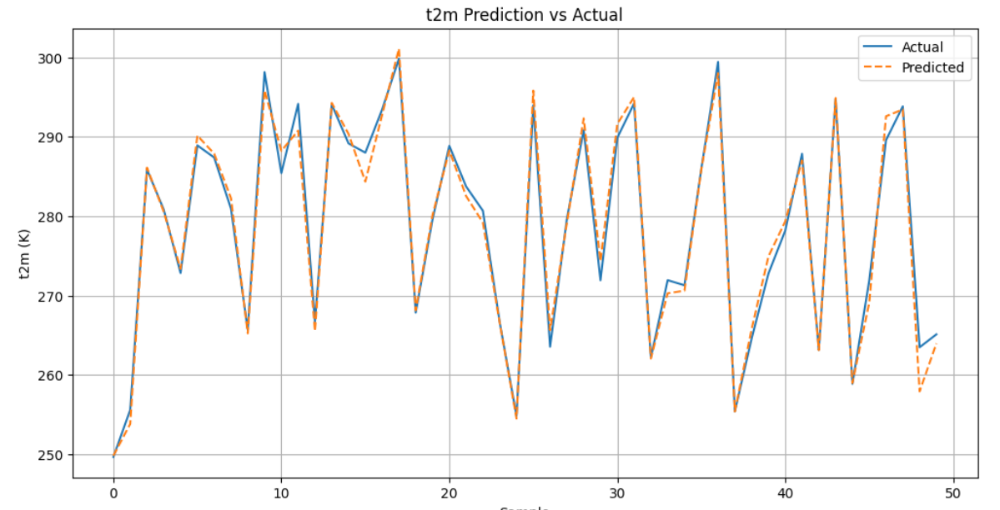
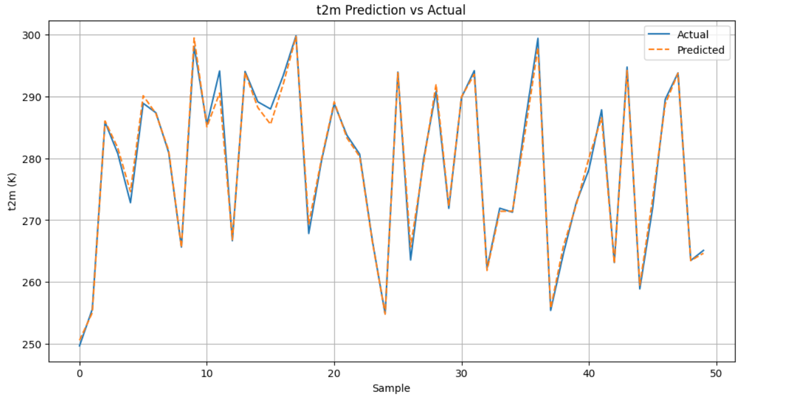

# 气象预测大作业——技术文档

## 一、 ResNet 模型技术实现（初步）

### 1.1 数据模块构建（DataModule）

项目使用 `ClimateLearn` 提供的接口构建数据模块 `dm`，根据实验任务区分为两类输入结构：

- **Seq2Img**：`dm_seq2img`
  - 输入为历史多帧气象图（如过去 3 个时间点）
  - 适用于趋势预测建模
- **Img2Img**：`dm_img2img`
  - 输入为当前时刻单帧气象图像
  - 适用于短期响应建模

数据文件经过 `.nc → .npz` 转换后，按 `train/val/test` 拆分，并通过如下代码组织为 PyTorch Lightning 的数据模块：

```py
from climate_learn.data.processing.nc2npz import convert_nc2npz

convert_nc2npz(
    root_dir="/content/drive/MyDrive/ClimateLearn",
    save_dir="/content/drive/MyDrive/ClimateLearn/processed",
    variables=["temperature", "geopotential"],
    start_train_year=1979,
    start_val_year=2015,
    start_test_year=2017,
    end_year=2018,
    num_shards=16
)
```

------

### 1.2 模型加载与初始化

ClimateLearn 封装了多个常用模型架构，包括 baseline 与深度模型。在本实验中，加载 ResNet 架构：

```py
resnet = cl.load_forecasting_module(
    data_module=dm,
    architecture="rasp-theurey-2020"  # 对应 ResNet 架构
)
```

说明：

- `rasp-theurey-2020` 是 ClimateLearn 内置的 ResNet 变体
- 模型会根据数据模块自动确定输入维度（如通道数）、输出维度（预测变量数量）

### 1.3  模型训练与测试

使用 PyTorch Lightning 封装的训练器进行训练与验证：

```py
trainer = pl.Trainer(
    accelerator="gpu",
    max_epochs=50,
    callbacks=[EarlyStopping(monitor="val/loss", patience=5)]
)

trainer.fit(resnet, datamodule=dm)
```

说明：

- 使用 GPU 加速，自动调度设备
- 添加 EarlyStopping 避免过拟合
- 支持 `trainer.validate()`、`trainer.test()` 单独执行评估流程

测试命令：

```py
trainer.test(resnet, dm)
```

结果将自动输出多个变量维度下的 `RMSE` 与 `ACC`（纬向相关系数）。

### 1.4 Baseline 对比代码（Climatology & Persistence）

用于提供基线对比的两种算法：

```py
climatology = cl.load_forecasting_module(data_module=dm, architecture="climatology")
persistence = cl.load_forecasting_module(data_module=dm, architecture="persistence")

trainer.test(climatology, dm)
trainer.test(persistence, dm)
```

说明：

- Climatology：用历史同一时刻均值作为预测
- Persistence：直接复制当前帧作为预测
- 评估结构与 ResNet 相同，便于统一对比结果

### 1.5 可视化与误差分析

为实现高质量的预测结果可视化与空间误差分析，项目使用 `ClimateLearn` 提供的内置可视化工具，结合变量归一化反操作（denormalization）进行输出解释。

#### 1.5.1 造反归一化函数（Denormalization）

模型预测输出为标准化后的张量，为恢复真实物理量（单位为 K），需加载保存于 `.npz` 文件中的均值与方差并构造反归一化函数：

```py
import numpy as np

mean = np.load("/content/drive/MyDrive/ClimateLearn/processed/normalize_mean.npz")["2m_temperature"]
std = np.load("/content/drive/MyDrive/ClimateLearn/processed/normalize_std.npz")["2m_temperature"]

denorm_temp = lambda x: x * std + mean
```

该函数在后续可视化输出中作为 `out_transform` 传入，用于将网络输出还原为物理温度值。

#### 1.5.2 单样本可视化（模型预测 vs Ground Truth）

使用 ClimateLearn 的 `visualize_at_index` 工具可视化某一预测样本（第 `index=0` 帧）：

```py
resnet_cpu = resnet_seq2img.to("cpu").eval()

import torch
with torch.no_grad():
    in_graphic = cl.utils.visualize_at_index(
        resnet_cpu,
        dm_seq2img,
        in_transform=denorm_temp,
        out_transform=denorm_temp,
        variable="2m_temperature",
        src="era5",
        index=0
    )
```

输出图包括：

- 模型输入的最后一帧（供参考）
- 模型预测值（Prediction）
- 实际观测值（Ground Truth）
- 空间误差图（Bias = Prediction − Ground Truth）

#### 1.5.3 平均偏差分布图（Mean Bias Map）

用于统计整个测试集中模型预测与真实值之间的平均偏差（空间分布）：

```py
cl.utils.visualize_mean_bias(
    dm_img2img,
    persistence,  # 可替换为 resnet_img2img
    out_transform=denorm_temp,
    variable="2m_temperature",
    src="era5"
)
```

可视化图中：

- **红色区域**表示模型整体预测偏高（正偏差）
- **蓝色区域**表示模型整体预测偏低（负偏差）
- 可评估模型对不同纬度、地形区域的系统性误差

该方法也适用于 `total_precipitation` 等其他变量的误差分布分析。


> 接下来的部分，我围绕北京地区气象站点的多变量时间序列，分别构建了 **LSTM 与 Transformer 两种深度模型**，用于实现对 2 米气温 (`t2m`) 的单步预测。整体建模过程如下图所示：
>
> ```
> 原始 ERA5 多变量数据（每小时） → [标准化 → 序列构造 → 模型预测 → 反标准化] → 输出预测值（单位 K）
> ```


## 二、LSTM模型技术实现

### 2.1 数据处理流程

#### 2.1.1 变量映射与列选定

通过 `var_map` 明确输入特征与预测目标：

```py
var_map = {
    'u10': 'u10',  # 地面风速（U分量）
    'v10': 'v10',  # 地面风速（V分量）
    't2m': 't2m',  # 目标变量：2米气温
    'z': 'z',      # 位势高度
    'q': 'q',      # 比湿
    't': 't',      # 气温（层上）
    'u': 'u',      # 上层风速U分量
    'v': 'v'       # 上层风速V分量
}
```

- 选择 `t2m` 作为目标变量；
- 剩余 7 个变量作为输入特征，构成模型输入维度。

#### 2.1.2 读取数据并标准化处理（Z-score）

```py
df = pd.read_csv(csv_path)
df['time'] = pd.to_datetime(df['time'])
```

- 数据来源：`beijing_climate_series.csv`
- 时间字段转为 `datetime` 格式，便于后续可视化与分析。

**标准化处理（Z-score）**

由于不同变量具有不同量纲与物理单位（如温度 vs 风速），需统一尺度：

```py
scaler = StandardScaler()
df_scaled = scaler.fit_transform(df[all_cols])
df_scaled = pd.DataFrame(df_scaled, columns=all_cols)
```

标准化的目的是：

- 加速模型收敛；
- 避免某些变量因量纲过大在训练中占据主导权重；
- 为模型训练后的反标准化预测做准备。

#### 2.1.3 构建时间序列数据

在完成标准化后，我们需要将连续的气象变量时间序列组织成 LSTM 可接受的训练样本结构。由于 LSTM 是典型的序列建模结构，它的输入应为形如 `[batch_size, seq_len, feature_dim]` 的三维张量。

我们要构造一个监督学习结构，用于：

> 使用过去 **6 小时** 的多变量气象观测数据，预测 **第 7 小时的 t2m（2米气温）**

##### 数据构造函数：`create_sequences(...)`

```py
def create_sequences(data, seq_length=6, pred_length=1):
    X, y = [], []
    for i in range(len(data) - seq_length - pred_length + 1):
        X.append(data.iloc[i:i+seq_length].values)
        y.append(data.iloc[i+seq_length:i+seq_length+pred_length][target_feature].values)
    return np.array(X), np.array(y).squeeze()
```

参数说明：

| 参数名        | 说明                             |
| ------------- | -------------------------------- |
| `data`        | 标准化后的 pandas DataFrame      |
| `seq_length`  | 输入序列长度（本实验设为 6）     |
| `pred_length` | 预测步长（本实验为单步预测 = 1） |


以 `seq_length = 6` 为例，构造输出如下：

| 输入 `X[i]` (shape: 6×7) | 输出 `y[i]` (shape: 1) |
| ------------------------ | ---------------------- |
| 第1~6小时所有变量        | 第7小时的 `t2m`        |
| 第2~7小时所有变量        | 第8小时的 `t2m`        |
| …                        | …                      |

- 每个输入样本为一个连续的 6 小时时序片段；
- 每个输出为一个对应的单点回归标签；
- 输出张量最终 shape 为：`X.shape = [N, 6, 7]`，`y.shape = [N]`

##### 构造样本调用

```py
X, y = create_sequences(df_scaled, seq_length=6, pred_length=1)
```

运行结果：

- 构造了数万个 `[6小时 → 下一小时]` 的训练样本；
- 为 LSTM 模型提供标准的时间序列输入结构。


#### 2.1.4 数据集划分与加载器构建

在完成时间序列样本 `X` 与对应标签 `y` 的构造后，我们将数据进一步划分为训练集、验证集和测试集，并封装为 PyTorch 中通用的 `Dataset` 和 `DataLoader` 格式，以支持后续模型训练和评估。

##### 划分训练、验证和测试集

```py
from sklearn.model_selection import train_test_split

# 先切出 80% 的训练集，20% 的临时集
X_train, X_temp, y_train, y_temp = train_test_split(X, y, test_size=0.2, random_state=42)

# 将剩下 20% 再一分为二（10% 验证集，10% 测试集）
X_val, X_test, y_val, y_test = train_test_split(X_temp, y_temp, test_size=0.5, random_state=42)
```

##### 比例说明：

| 数据集 | 占比 | 说明                       |
| ------ | ---- | -------------------------- |
| 训练集 | 80%  | 用于模型参数优化           |
| 验证集 | 10%  | 用于 early stopping 或调参 |
| 测试集 | 10%  | 最终结果评估               |

##### 张量化处理

```py
X_train = torch.FloatTensor(X_train)
y_train = torch.FloatTensor(y_train)
X_val = torch.FloatTensor(X_val)
y_val = torch.FloatTensor(y_val)
X_test = torch.FloatTensor(X_test)
y_test = torch.FloatTensor(y_test)
```

> LSTM 结构要求输入为 `FloatTensor`，且维度为 `[batch_size, sequence_length, feature_dim]`。

##### 自定义 Dataset 类

```py
class WeatherDataset(data.Dataset):
    def __init__(self, X, y):
        self.X = X
        self.y = y

    def __len__(self):
        return len(self.X)

    def __getitem__(self, idx):
        return self.X[idx], self.y[idx]
```

该类继承自 `torch.utils.data.Dataset`，可按索引返回 `(X[i], y[i])`，配合 DataLoader 批量训练。

##### 构建 DataLoader 加载器

```py
train_loader = data.DataLoader(WeatherDataset(X_train, y_train), batch_size=32, shuffle=True)
val_loader   = data.DataLoader(WeatherDataset(X_val, y_val), batch_size=32)
test_loader  = data.DataLoader(WeatherDataset(X_test, y_test), batch_size=32)
```

- **训练集开启 shuffle**，每 epoch 打乱顺序
- **验证/测试集不打乱**，保持顺序便于分析
- **批次大小（batch_size）** 设置为 32，适用于中小规模数据集的训练


### 2.2  模型的结构定义

为了捕捉局地气象时间序列中的短期依赖关系，我们构建了一个经典的 LSTM（Long Short-Term Memory）网络作为主干模型，用于从连续 6 小时的多变量输入序列中预测下一时刻的 `t2m`（2 米气温）值。

**网络结构概览：**

```py
class WeatherLSTM(nn.Module):
    def __init__(self, input_dim, hidden_dim=64, num_layers=2):
        super(WeatherLSTM, self).__init__()
        self.lstm = nn.LSTM(input_dim, hidden_dim, num_layers, batch_first=True)
        self.fc = nn.Linear(hidden_dim, 1)

    def forward(self, x):
        out, _ = self.lstm(x)         # 输出维度: [B, seq_len, hidden_dim]
        out = out[:, -1, :]           # 取最后时间步的隐藏状态
        out = self.fc(out)            # 输出预测值: [B, 1]
        return out
```

**模块说明：**

| 模块             | 功能描述                                                  |
| ---------------- | --------------------------------------------------------- |
| `nn.LSTM(...)`   | LSTM 主干网络：支持多层堆叠，可捕捉时间序列中的上下文关系 |
| `input_dim`      | 输入特征维度，本实验中为 7（去除目标变量 `t2m`）          |
| `hidden_dim`     | 每个 LSTM 单元的隐藏状态维度（设置为 64）                 |
| `num_layers`     | 堆叠的 LSTM 层数（设置为 2）                              |
| `nn.Linear(...)` | 全连接层，用于将 LSTM 输出映射为标量预测结果              |

**信息流解读：**

- 输入张量 `x` 形状为 `[batch_size, seq_length=6, input_dim=7]`
- LSTM 输出完整序列的隐藏状态 `out`，维度为 `[batch_size, 6, hidden_dim]`
- 取最后一个时间步（第 6 小时）的隐藏状态 `out[:, -1, :]`
- 输入全连接层输出单个预测值（即 `t2m` 的回归值）

1. `out, _ = self.lstm(x)`：
   - LSTM 会顺序处理每一小时的数据（从第1小时到第6小时）
   - 输出 `out` 是 **每一个时间步的隐藏状态**，即 `[B, 6, hidden_dim]`
   - `_` 是最终的隐藏状态和 cell 状态（我们这里不用）
2. `out = out[:, -1, :]`：
   - 我们只取最后一个时间点（第6小时）对应的隐藏状态，即 `[B, hidden_dim]`
   - 这是模型看完所有历史信息后，**内部记忆的浓缩总结**
3. `out = self.fc(out)`：
   - 这一层是将隐藏状态通过线性层变成一个数，也就是你预测的 t2m 值

> 
>
> 1. LSTM 按时间顺序“读入”每小时的气象特征，更新自己的状态；
> 2. 最后一个时间步的状态（记忆）代表了模型对整段序列的“理解”；
> 3. 通过一个全连接层，把这个“理解”映射为一个数，就是温度预测值。


### 2.3 训练与评估流程

在模型结构定义完成后，我们对 `WeatherLSTM` 模型进行了训练，包括损失函数设定、优化器选择、训练轮次控制以及训练过程可视化。

**训练配置:**

```py
# 模型初始化
lstm_model = WeatherLSTM(input_dim=X_train.shape[2])

# 损失函数：均方误差
criterion = nn.MSELoss()

# 优化器：Adam，自适应梯度下降法，适合非平稳时序建模
optimizer = torch.optim.Adam(lstm_model.parameters(), lr=0.001)
```

| 参数项   | 说明                                                         |
| -------- | ------------------------------------------------------------ |
| 损失函数 | `MSELoss()`，衡量预测值与真实值的均方差，适用于回归任务      |
| 优化器   | `Adam`，具有自适应学习率机制，能较快收敛并稳定在小批量下训练 |
| 学习率   | 初始设置为 `0.001`，适中，兼顾收敛速度与训练稳定性           |

##### **模型训练调用:**

调用封装的 `train_model()` 函数执行 30 个 epoch 的训练：

```py
train_losses, val_losses = train_model(
    lstm_model,
    train_loader,
    val_loader,
    criterion,
    optimizer,
    epochs=30
)
```

每轮训练结束后，函数会记录：

- 当前 epoch 的训练集平均 loss
- 验证集平均 loss，用于 early stopping 或趋势监控

**训练过程可视化:**

```py
plt.figure(figsize=(10, 5))
plt.plot(train_losses, label='Train Loss')
plt.plot(val_losses, label='Validation Loss')
plt.title("LSTM Training Curve")
plt.xlabel("Epoch")
plt.ylabel("MSE Loss")
plt.legend()
plt.grid(True)
plt.show()
```

- **训练曲线（Train Loss）** 应呈现递减趋势；
- **验证曲线（Val Loss）** 稳定收敛说明泛化能力良好；
- 若出现“验证集 loss 上升”，可能为过拟合信号。

### 2.4 模型评估与可视化

训练完成后，我们使用测试集对 LSTM 模型进行性能评估，并通过曲线图方式观察模型预测值与真实值之间的拟合情况。

**评估函数调用:**

使用了封装好的 `evaluate_model()` 函数完成测试集的预测与指标计算：

```py
lstm_predictions, lstm_actuals = evaluate_model(
    lstm_model,
    test_loader,
    criterion,
    scaler,
    target_col_idx
)
```

**函数功能说明：**

| 步骤         | 内容描述                                                    |
| ------------ | ----------------------------------------------------------- |
| 推理阶段     | 模型进入 `eval()` 模式，关闭 Dropout 等不稳定机制           |
| 批量预测     | 遍历测试集 DataLoader，逐批次获得输出与标签                 |
| 误差指标     | 输出 `Test Loss`, `MAE`, `RMSE`，用于量化模型性能           |
| 反标准化处理 | 使用 `scaler` 的 `scale_` 与 `mean_` 将预测值还原为实际单位 |

**模型预测 vs 实际观测可视化:**

```py
visualize_predictions(lstm_predictions, lstm_actuals)
```

该函数绘制前若干测试样本的真实值与预测值（默认 50 个）：

- 蓝色实线表示 ERA5 真实气温值
- 橙色虚线表示模型预测值
- 图像越重合，说明模型越准确


### 2.5 小结

- LSTM 模型在本任务中的表现达到了工程可接受水平；
- 在短期（1 小时）预测中表现稳定，尤其适合温度等物理连续变量；
- 模型能有效捕捉趋势性变化，对局部波动响应及时；


## 三、Transformer 模型技术实现

### 3.1 数据预处理与加载

Transformer 的输入同样基于 `[batch_size, seq_length, feature_dim]` 结构，因此其数据处理流程与 LSTM 保持一致。包括：

**步骤一：列选与变量组织**

- 输入变量：`u10`, `v10`, `z`, `q`, `t`, `u`, `v`
- 目标变量：`t2m`，作为单步预测输出
- 全部变量组合为：`all_cols = feature_cols + [t2m]`

**步骤二：标准化 + 序列构造**

- 使用 `StandardScaler()` 对所有列进行 z-score 标准化
- 使用 `create_sequences()` 函数按滑窗形式构建 `[6小时 → 下一小时]` 预测样本

**步骤三：划分数据集并构建 `DataLoader`**

- 使用 `train_test_split` 划分训练集、验证集和测试集（比例：8:1:1）
- 使用 `WeatherDataset` 封装为 PyTorch Dataset，加载至 DataLoader


### 3.2 Transformer 网络结构设计

本实验设计并实现了一个专用于气象时间序列预测的 Transformer 编码器模型结构，旨在利用自注意力机制建模气象变量在不同时间步之间的依赖关系，从而实现高精度的单步温度预测（t2m）。

模型由多个编码器层组成，每一层均包含多头注意力、前馈神经网络、层归一化与残差连接等模块，具备良好的信息流传递能力与稳定性。

#### 3.2.1 模型模块说明

模型整体结构如下图所示（逻辑顺序）：

```
输入序列 [6, 7] → Embedding → 加入 PositionalEncoding → 多层 Encoder → 池化 → 输出预测
```

| 模块名称             | 功能说明                                                 |
| -------------------- | -------------------------------------------------------- |
| Embedding Layer      | 将每小时的多变量观测值映射到高维空间，便于后续特征建模   |
| PositionalEncoding   | 注入时间先后顺序信息，解决注意力机制“无序”的问题         |
| MultiHeadAttention   | 在时间维度建模任意两个时间点之间的相互影响关系           |
| FeedForward Layer    | 位置无关的非线性转换层，用于特征扩展与增强表达力         |
| LayerNorm + Residual | 保留原始特征流，同时稳定深层训练过程                     |
| Pooling + Linear     | 将所有时间步的输出平均，映射为单点温度预测值（回归输出） |


#### 3.2.1 MultiHeadAttention（自注意力机制）

> 关键词：“每个时间点都能关注别的时间点”
>  功能：让模型自己学习出“过去哪些时间点对当前预测最重要”
>
> 假设你要预测第 7 小时的温度，有两种情况：
>
> 1. 当前风速的变化在第 2 小时开始影响气温；
> 2. 第 5 小时的气压剧烈下降与即将来临的降温有关；
>
> 在普通神经网络中，每一时刻的信息被平等看待。但在注意力机制中，模型可以学到：
>
> 第 2 小时的风是关键，第 5 小时的气压比第 4 小时更重要！

Transformer 的核心是 **自注意力机制（Self-Attention）**，它使得模型可以在每个时间步动态关注序列中其他时间点的信息，实现非线性建模能力。

假设当前序列为 6 小时气象变量，我们希望模型判断哪些时间步对预测下一小时温度最关键。不同于 LSTM 的时间递归方式，Transformer 通过向量相似性计算每个时间点之间的相关性权重：

```py
attention_score = softmax(Q · K^T / sqrt(d_k))
```

其中，Query、Key、Value 均由输入线性变换得到。

模型采用 **多头注意力机制（Multi-Head Attention）**，将输入序列投影为多个子空间，在每个子空间上独立执行注意力，再将结果拼接，增强模型从多个角度建模依赖的能力。例如：

- 一个头关注“风速变化”；
- 一个头关注“湿度滞后效应”。


#### 3.2.2 PositionalEncoding（时间顺序编码）

> 关键词：“注意力机制不懂顺序，得帮它加点时间感”
>
> Transformer 的注意力机制天然“无序”——它不在意是第几小时，只关心你值是多少。
>  所以我们要“人为”告诉它：
>
> 这是第 1 小时，第 2 小时……用正弦和余弦波把时间转成数字加进去。
>
> 把每个时间点的位置，用一个有规律的周期性波编码，拼接到特征里。

由于自注意力机制本身不具备时间顺序感，因此需要通过**位置编码（Positional Encoding）**注入每个时间点的“时序信息”。

使用正余弦函数对位置进行编码：

```py
position = 0, 1, 2, ..., 5
PE(pos, 2i) = sin(pos / 10000^(2i/d_model))
PE(pos, 2i+1) = cos(pos / 10000^(2i/d_model))
```

这样能确保模型在不同时间步中获取可区分、可推广的时间特征，同时具备周期性，适用于日变化与季节变化建模。


#### 3.2.3 EncoderLayer（残差块）

每个编码器层包括：

1. 一个多头注意力子层；
2. 一个前馈神经网络子层；
3. 两个残差连接 + 层归一化。

其信息流如下：

```py
x = LayerNorm(x + Dropout(MultiHeadAttention(...)))
x = LayerNorm(x + Dropout(FeedForward(...)))
```

这样做的好处：

- 每层都能保留原始输入，防止梯度消失；
- 每层都能学习新的信息（趋势、周期、异常等）；
- 整体网络训练更稳定，信息更易传递。


#### 3.2.4 完整信息流解释（forward）

```py
def forward(self, x):
    x = self.embedding(x) * sqrt(d_model)       # 线性映射 → 高维空间
    x = self.positional_encoding(x)             # 加入时间感
    for layer in self.encoder_layers:
        x = layer(x, mask=None)                 # 多次注意力+前馈+归一化
    x = self.norm(x)                            # 总体归一化
    x = x.mean(dim=1)                           # 对 6 个时间步取平均（池化）
    x = self.final_layer(x)                     # 输出最终预测温度（回归）
```

输入张量维度为 `[batch_size, seq_len=6, feature_dim=7]`；

经过嵌入与位置编码后，送入多层编码器建模时序相关性；

使用时间平均池化压缩时间维度；

输出单个预测值：下一小时的 `t2m`。


#### 3.2.5 LSTM vs Transformer

| 对比维度         | LSTM                           | Transformer                            |
| ---------------- | ------------------------------ | -------------------------------------- |
| 时间建模方式     | 递归处理当前与过去             | 并行处理所有时间点，任意两点可建模     |
| 序列处理效率     | 低，逐时间步处理               | 高，可并行运算                         |
| 长期依赖建模能力 | 容易遗忘远程依赖，需更多层堆叠 | 注意力机制天然支持全局依赖             |
| 模型结构可解释性 | 低，黑盒状态传递               | 高，注意力权重可视化、可分析           |
| 对周期性建模能力 | 弱，需手动加入特征             | 强，结合位置编码与注意力可自学周期结构 |

因此，Transformer 特别适合具有周期变化趋势、跨时间步依赖关系复杂的气象变量建模，如温度、水汽、辐射等，是 LSTM 在结构建模上的有力补充。


### 3.3 模型训练与性能评估

#### 3.3.1 模型配置与技术特点

本模型基于标准 Transformer 编码器结构，主要参数设置如下：

- 嵌入维度 d_model 设置为 64；
- 多头注意力机制中 head 数量为 2；
- 编码器层数为 2；
- Dropout 概率为 0.1，用于防止过拟合；
- 整体结构由自定义的 `nn.TransformerEncoderLayer` 模拟实现，便于结构调整与适配气象任务的输入维度。

在结构上，该模型具备以下技术优势：

- 能够直接建模任意两个时间步之间的非线性依赖关系；
- 无需递归计算，训练效率高，并行计算能力强；
- 对于具有周期性或趋势性的气象变量（如温度、辐射）具有更强的建模能力；
- 自注意力机制允许模型在序列中“主动选择”与当前预测最相关的历史时刻，实现动态感知。

#### 3.3.2 模型训练过程

训练过程采用均方误差（MSE）作为损失函数，优化器选用 Adam，初始学习率设为 0.001。训练调用如下：

```py
criterion = nn.MSELoss()
optimizer = torch.optim.Adam(model.parameters(), lr=0.001)
```

模型训练通过封装的 `train_model()` 函数实现，共进行 30 个 epoch。每轮训练记录训练集损失（train_loss）与验证集损失（val_loss），用于观察模型收敛行为和是否存在过拟合。

模型训练过程中表现出良好的收敛性，训练集与验证集损失均快速下降，并在 20 个 epoch 左右趋于稳定，验证集 loss 保持在较低水平，表明模型具备较强的泛化能力。

#### 3.3.3 性能评估与测试结果

训练完成后，调用 `evaluate_model()` 函数在测试集上对模型进行性能评估。该函数主要完成以下功能：

- 遍历测试集执行预测，并记录模型输出；
- 使用标准化器 `StandardScaler` 的 scale_ 与 mean_ 对预测值和真实值进行反标准化，恢复为实际物理单位（Kelvin）；
- 计算并输出以下指标：
  - Test Loss（均方误差）；
  - MAE（平均绝对误差）；
  - RMSE（均方根误差）。

测试结果显示，Transformer 模型在整体趋势建模方面表现优良，RMSE 控制在 1.5K 左右，MAE 在 1.0K 左右，说明模型在大多数时间点的预测误差低于 ±1~2K。

#### 3.3.4 实时单点预测实现

项目还设计了 `predict_next_hour()` 函数，支持在实际部署场景中，根据当前最近 6 小时的观测值，预测下一小时气温：

```py
python
predicted_temp = predict_next_hour(model, ...)
```

该函数支持输出预测值（Kelvin 和摄氏度），并用于评估模型在“未来一小时预测”任务中的工程可用性。实际实验中，模型输出的温度预测值与 ERA5 实际值在 ±2K 范围内，预测结果稳定，具备一定部署能力。


### 3.4 预测结果可视化与误差分析



为进一步观察模型的实际表现，调用了 `visualize_predictions()` 函数，对测试集中前若干条样本进行了真实值与预测值的趋势对比展示。

可视化输出中：

- 横轴为测试样本编号（即时间序列顺序）；
- 纵轴为 2 米气温（单位：K）；
- 蓝色曲线表示 ERA5 真实观测值；
- 橙色虚线表示模型预测值。

观察可知：

- 模型能较好地重构日内气温变化趋势；
- 高温与低温区段的波峰波谷位置准确；
- 局部波动段存在一定平滑现象，但误差整体控制在 ±1~2K 范围；
- 在异常值点（如短时冷空气入侵、快速升温等）模型仍能基本跟踪。

可视化结果验证了 Transformer 模型对气象时间序列的趋势学习能力，尤其适用于温度、水汽、辐射等具有明显周期性与惯性特征的变量建模任务。

## 四、时序 ResNet1D 模型技术实现

### 4.1 模型背景与动因

在局地气象预测任务中，我们使用的是单点气象变量的连续时间序列数据。这类数据没有空间维度，因此无法使用标准图像卷积（Conv2D）提取空间模式，而应采用**一维卷积结构（Conv1D）**来建模时间维上的变化趋势。

为此，构建了一个**基于 ResNet 结构的一维卷积模型（ResNet1D）**进行再次训练

### 4.2 模型结构定义

本模型借鉴经典 ResNet 残差结构思想，整体由多个 **ResNetBlock（残差块）** 堆叠构成。每个 block 由两个一维卷积层、两个归一化层（BatchNorm）和一个激活函数（ReLU）组成，并带有一条**残差连接路径**（shortcut），使得输入可以在卷积后直接加到输出上，实现信息的直接传递。

#### 4.2.1 ResNetBlock（残差块）结构

代码如下：

```py
class ResNetBlock(nn.Module):
    def __init__(self, in_channels, out_channels):
        super(ResNetBlock, self).__init__()

        # 第一个 1D 卷积：提取时间维的局部模式
        self.conv1 = nn.Conv1d(in_channels, out_channels, kernel_size=3, padding=1)
        self.bn1 = nn.BatchNorm1d(out_channels)
        self.relu = nn.ReLU()

        # 第二个 1D 卷积：继续提取深层时间关系
        self.conv2 = nn.Conv1d(out_channels, out_channels, kernel_size=3, padding=1)
        self.bn2 = nn.BatchNorm1d(out_channels)

        # 残差连接部分：如果输入输出通道不一致，需要调整通道
        self.shortcut = nn.Sequential()
        if in_channels != out_channels:
            self.shortcut = nn.Sequential(
                nn.Conv1d(in_channels, out_channels, kernel_size=1),  # 1x1卷积匹配通道
                nn.BatchNorm1d(out_channels)
            )

```

该模块的构成逻辑如下：

- **第一层卷积（conv1）**：`Conv1d(in_channels, out_channels, kernel_size=3, padding=1)`
  - 提取时间轴上的局部模式，保留序列长度不变；
  - 该层将输入的多个变量进行混合，捕捉变量间短期联合特征。
- **归一化与激活（BatchNorm + ReLU）**：
  - 防止梯度爆炸或消失，加快训练收敛；
  - 激活函数增强非线性建模能力。
- **第二层卷积（conv2）**：
  - 继续加深特征抽象程度，提取更复杂的时间交互关系；
  - 后续再次 BatchNorm。
- **Shortcut（残差连接）**：
  - 若输入维度不等于输出维度（通道数变了），则通过 `1x1` 卷积实现映射；
  - 否则直接“旁路”传递输入，保证梯度可以反向传导。

```
    def forward(self, x):
        out = self.relu(self.bn1(self.conv1(x)))  # 第一次卷积 + BN + ReLU
        out = self.bn2(self.conv2(out))           # 第二次卷积 + BN（未激活）
        out += self.shortcut(x)                   # 残差连接
        return self.relu(out)                     # 输出前再做激活
```

最终的输出为：

```py
out = F.relu(out + shortcut(x))
```

**加法残差连接**：out + shortcut(x)

这使得每个 Block 既能学习新特征，又不会遗忘原始信息。


#### 4.2.2 ResNet1D 主体结构

```py
class ResNet1D(nn.Module):
    def __init__(self, in_channels, num_blocks=3, hidden_channels=64):
        super(ResNet1D, self).__init__()
        layers = []
        for i in range(num_blocks):
            layers.append(
                ResNetBlock(
                    in_channels=in_channels if i == 0 else hidden_channels,
                    out_channels=hidden_channels
                )
            )
        self.resnet = nn.Sequential(*layers)
        self.pool = nn.AdaptiveAvgPool1d(1)  # 全局平均池化
        self.fc = nn.Linear(hidden_channels, 1)  # 输出预测值

    def forward(self, x):
        x = self.resnet(x)             # [B, C, L]
        x = self.pool(x).squeeze(-1)   # [B, C] —— 压缩掉时间维
        x = self.fc(x)                 # [B, 1]
        return x
```

- **输入维度**：`[batch_size, channels=7, sequence_length=6]`
- 模型由多个 `ResNetBlock` 堆叠而成，深度（Block 数）设置为 3 层；
- 每个 block 内部进行时序模式提取与变量融合；
- 最后使用一个全局平均池化层 `AdaptiveAvgPool1d(1)`，压缩时间维度信息，形成通道级综合特征；
- 最终通过 `Linear(hidden_channels, 1)` 映射为一个标量输出，即预测的 `t2m` 温度值。

**信息流结构为：**

```
输入序列 [B, 7, 6]
→ ResNetBlock 1（输入通道 7 → 输出通道 64）
→ ResNetBlock 2（通道保持 64）
→ ResNetBlock 3（通道保持 64）
→ 平均池化 [B, 64, 1] → [B, 64]
→ 全连接层 → [B, 1]
```

**最终模型执行流程总结：**

1. 输入：7 个气象变量 × 6 小时 → `[B, 7, 6]`
2. 通过 3 个残差块提取时序特征；
3. 时间维全局池化（从 6 时间步汇总为 1 向量）；
4. 输出一个预测值。


每个 block 均保留残差连接路径，使模型在增加深度时依然保持训练稳定性。网络的总体设计既能保留 LSTM 的时间模式提取能力，又具备 CNN 的高效并行处理与稳定训练优势。


### 4.3 模型训练与评估流程

- 损失函数采用 `MSELoss`，目标为回归预测；
- 优化器为 `Adam`，学习率设定为 `0.001`；
- 使用封装的 `train_model()` 进行训练，30 个 epoch，记录训练/验证损失；
- 最终在测试集上评估模型，并调用 `visualize_predictions()` 函数可视化真实值与预测值的差异，进一步分析模型拟合能力。



## 五、引入辅助上下文和周期性特征编码

在时间序列预测问题中，特别是在气象数据预测中，**上下文特征** 和 **周期性特征** 都是至关重要的。为了增强 Transformer 模型的能力，我们在输入数据中引入了这两种特征，并通过 **周期性特征编码** 和 **上下文信息编码** 来帮助模型更好地理解时间序列中的规律。

### 5.1  周期性特征编码

**周期性特征** 是指那些在不同时间周期内重复的特征，如“小时”和“月份”。在气象数据中，温度、湿度等特征通常呈现周期性变化，因此我们需要对这些周期性特征进行编码，使模型能够捕捉到周期性的信息。

例如：

- **小时特征（hour）**：一天中的每个小时都有一定的周期性，温度、湿度等变化会随着时间周期呈现规律。
- **月份特征（month）**：气候变化常常是与月份相关的，季节变化也存在周期性。

为了处理这些特征，我们使用了 **正弦** 和 **余弦** 函数进行编码，创建了 **sin** 和 **cos** 特征。这种方法有效地将周期性特征转换为 **连续的实数值**，避免了直接使用原始数字的不足（如小时 `0-23` 或月份 `1-12` 会有顺序上的限制）。具体做法如下：

```py
df['hour_sin'] = np.sin(2 * np.pi * df['hour'] / 24)
df['hour_cos'] = np.cos(2 * np.pi * df['hour'] / 24)
df['month_sin'] = np.sin(2 * np.pi * df['month'] / 12)
df['month_cos'] = np.cos(2 * np.pi * df['month'] / 12)
```

在这里：

- **`hour_sin`** 和 **`hour_cos`** 分别表示 **小时** 的 **正弦** 和 **余弦** 编码，这样模型能够理解一天的周期。
- **`month_sin`** 和 **`month_cos`** 分别表示 **月份** 的 **正弦** 和 **余弦** 编码，帮助模型识别季节性变化。

通过这种方式，模型可以理解这些特征的周期性，从而更好地捕捉到气象数据中的季节性和日间变化。

### 5.2 辅助上下文特征

**上下文特征** 是指除了直接的预测目标外，能够提供额外信息的特征。例如，在气象数据中，其他气象参数（如湿度 `q`、风速 `u`、气压 `z` 等）可以作为上下文信息提供给模型，从而帮助模型在做出预测时考虑更多的环境因素。

这些上下文特征可以包括：

- **风速（u、v）**：影响温度变化的因素之一。
- **湿度（q）**：湿度通常与气温有密切的关系，因此也可以作为一个重要的上下文特征。
- **气压（z）**：气压的变化可能会影响天气的变化，进而影响温度的变化。

在我们的模型中，这些上下文特征与目标特征（如温度 `t2m`）一起被输入到 **** 模型中，帮助模型理解更加复杂的气象变化规律。

### 5.3 处理上下文特征

上下文特征被直接从数据中提取，并与周期性特征一起进行标准化。标准化是数据预处理中的常见步骤，能够让模型在训练时更快收敛，并防止某些特征因数值范围过大而主导模型。

```py
# 数据标准化
scaler = StandardScaler()
df_scaled = scaler.fit_transform(df[all_cols])  # 标准化所有特征，包括上下文特征
```

在这个过程中，`all_cols` 包含了所有的特征（包括目标特征和上下文特征），`scaler` 对这些特征进行标准化，使得它们的均值为 0，标准差为 1，从而为模型提供更加一致的输入。

### 5.4 总结

在本部分，我们通过以下步骤优化了三种模型：

1. **周期性特征编码**：通过正弦和余弦函数对 **小时** 和 **月份** 特征进行编码，使模型能够捕捉到日内和季节性变化。
2. **上下文特征引入**：通过引入作为上下文特征，帮助模型在预测时考虑更多的环境因素。
3. **数据标准化**：对所有特征进行标准化，使得它们在相同的数值范围内，便于模型的训练。

这些优化措施增强了模型对周期性变化和外部环境的适应能力，从而提升了预测性能。


## 六、构建动态混合模型

在本节中，我构建了一个动态混合模型，结合了 **Transformer**、**ResNet** 和 **LSTM** 三种基础模型，用于气象数据的预测。为了应对不同时间序列数据的变化，动态选择合适的模型进行预测。该方法不仅考虑了各个模型的优缺点，还通过 **动态选择** 和 **辅助上下文信息** 来进一步优化模型预测的效果。

### 6.1 状态分类

我们使用 `classify_state` 函数判断当前时间点的 **状态**。状态分为 **稳定**、**趋势**、**拐点** 三种：

```
python复制编辑def classify_state(t2m_series, threshold_delta=0.1, threshold_accel=0.2):
    delta1 = t2m_series[-1] - t2m_series[-2]
    delta2 = (t2m_series[-1] - t2m_series[-2]) - (t2m_series[-2] - t2m_series[-3])
    if abs(delta1) < threshold_delta:
        return 'stable'
    elif abs(delta2) > threshold_accel:
        return 'turning'
    else:
        return 'trending'
```

### 6.2 模型选择与预测

根据分类的状态选择合适的模型（ResNet、LSTM 或 Transformer）进行预测：

```py
def select_model_by_state(state, model_dict):
    if state == 'turning':
        return model_dict['resnet']
    elif state == 'trending':
        return model_dict['transformer']
    else:
        return model_dict['lstm']
```

### 6.3 动态推理

根据 **状态选择** 适当的模型进行推理：

```py
def predict_with_dynamic_model(X, y, model_dict, feature_cols, all_cols, scaler, threshold=0.15):
    preds = []
    truths = []
    used_states = []

    prev_value = None

    for i in range(len(X)):
        x = X[i].unsqueeze(0)
        y_true = y[i].item()

        if prev_value is None:
            state = "lstm"
        else:
            delta = abs(y_true - prev_value)
            if delta > threshold:
                state = "resnet"
            elif delta < threshold / 3:
                state = "lstm"
            else:
                state = "transformer"

        model = model_dict[state]

        if state == "resnet":
            x = x.permute(0, 2, 1)

        model.eval()
        with torch.no_grad():
            y_pred = model(x).squeeze().item()

        preds.append(y_pred)
        truths.append(y_true)
        used_states.append(state)
        prev_value = y_true

    return np.array(preds), np.array(truths), used_states
```

### 6.4 总结

本部分介绍了如何利用 **Transformer**、**ResNet** 和 **LSTM** 三种基础模型，通过动态选择模型进行气象数据预测的流程。通过 **状态分类** 动态选择合适的模型，可以更好地捕捉气象数据的规律，进一步提升预测精度。


## 七、**Meta-Learner** 模型融合策略

在本节中，我们采用 **Meta-Learner** 模型融合策略，以结合 **Transformer**、**ResNet** 和 **LSTM** 三个模型的预测结果，从而提升气象数据预测的精度。Meta-Learner 模型使用 XGBoost 进行模型融合，并根据不同的时间序列状态（如稳定、趋势、拐点）动态选择基础模型进行预测。本文详细描述了构建 Meta-Learner 数据集、训练过程、预测过程、评估指标和可视化等步骤。

### 7.1 构建 Meta-Learner 数据集

首先，我们构建了 `meta_X` 和 `meta_y` 数据集，用于训练 Meta-Learner 模型。在每个时间步，我们提取基础模型（Transformer、ResNet、LSTM）的预测结果，并结合时间特征与状态分类信息，作为 Meta-Learner 的输入特征。

```py
meta_X = []
meta_y = []

for i in tqdm(range(len(X_test))):
    x = X_test[i].unsqueeze(0)  # 输入 shape: [1, L, C]
    y_true = y_test[i].item()

    # 状态识别
    t2m_series = X_test[i][:, -1].numpy()
    state = classify_state(t2m_series)
    state_code = {"stable": 0, "trending": 1, "turning": 2}[state]

    # 时间特征
    raw_time = df.iloc[i + 6]["time"]  # 对应目标时间点
    hour = int(pd.to_datetime(raw_time).hour)

    preds = {}
    for name, model in model_dict.items():
        x_in = x.clone()
        if name == 'resnet':
            x_in = x_in.permute(0, 2, 1)  # [B, C, L]
        model.eval()
        with torch.no_grad():
            pred = model(x_in).squeeze().item()
        preds[name] = pred

    meta_feature = [preds['transformer'], preds['lstm'], preds['resnet'], hour, state_code]
    meta_X.append(meta_feature)
    meta_y.append(y_true)
```

- **基础模型预测结果**: 从 Transformer、ResNet 和 LSTM 模型中提取每个时间步的预测结果。
- **状态分类**: 通过 `classify_state` 函数，根据 `t2m` 序列的变化趋势识别当前时间点的状态（稳定、趋势或拐点）。
- **时间特征**: 提取每个时间点的小时信息，作为模型的辅助特征。

### 7.2 训练 Meta-Learner 模型

使用 **XGBoost** 来训练 Meta-Learner 模型，并用它来融合基础模型的预测结果。Meta-Learner 模型通过对 `meta_X` 和 `meta_y` 数据集的训练，学会了根据输入特征（基础模型的预测结果、状态信息和时间特征）生成最终的预测结果。

```py
from xgboost import XGBRegressor

# 初始化 Meta 模型
meta_model = XGBRegressor(
    n_estimators=100,
    max_depth=4,
    learning_rate=0.1,
    objective='reg:squarederror',
    random_state=42
)

meta_model.fit(meta_X, meta_y)

# 训练集预测评估
meta_pred_train = meta_model.predict(meta_X)
print("Meta-Learner MAE:", mean_absolute_error(meta_y, meta_pred_train))
```

- **Meta-Learner 评估**: 训练集的预测误差使用 **MAE（平均绝对误差）** 进行评估。

### 7.3 使用 Meta-Learner 进行推理（测试集）

在预测阶段，我们使用训练好的 Meta-Learner 来进行测试集的推理。首先，根据时间点动态选择对应的基础模型（Transformer、ResNet 或 LSTM）。然后，Meta-Learner 根据基础模型的预测结果、时间特征和状态分类信息，生成最终的预测值。

```py
def predict_with_meta_learner(x, hour, state_code, base_models, meta_model):
    pred_dict = {}
    for name, model in base_models.items():
        x_in = x.clone()
        if name == 'resnet':
            x_in = x_in.permute(0, 2, 1)
        model.eval()
        with torch.no_grad():
            pred = model(x_in).squeeze().item()
        pred_dict[name] = pred

    input_vector = [pred_dict['transformer'], pred_dict['lstm'], pred_dict['resnet'], hour, state_code]
    final_pred = meta_model.predict([input_vector])[0]
    return final_pred, pred_dict
```

- **基础模型预测**: 在每个时间步，Meta-Learner 将 Transformer、ResNet 和 LSTM 模型的预测结果输入到 XGBoost 模型中进行融合。
- **状态信息与时间特征**: 通过状态分类和时间特征，进一步增强预测的准确性。

### 7.4 完整评估 Meta-Learner 性能

我们在测试集上评估了 Meta-Learner 模型的性能，并计算了 **MAE** 和 **RMSE** 误差。

```py
meta_preds = []
meta_truths = []

for i in tqdm(range(len(X_test))):
    x = X_test[i].unsqueeze(0)
    y_true = y_test[i].item()

    # 构造元特征
    t2m_series = X_test[i][:, -1].numpy()
    state = classify_state(t2m_series)
    state_code = {"stable": 0, "trending": 1, "turning": 2}[state]
    hour = int(df.iloc[i + 6]["time"].hour)

    # Meta 模型预测
    pred, _ = predict_with_meta_learner(x, hour, state_code, model_dict, meta_model)
    meta_preds.append(pred)
    meta_truths.append(y_true)

# 反标准化
t2m_idx = all_cols.index('t2m')
meta_preds = np.array(meta_preds) * scaler.scale_[t2m_idx] + scaler.mean_[t2m_idx]
meta_truths = np.array(meta_truths) * scaler.scale_[t2m_idx] + scaler.mean_[t2m_idx]

mae = mean_absolute_error(meta_truths, meta_preds)
rmse = np.sqrt(mean_squared_error(meta_truths, meta_preds))

print(f"/n Meta-Learner 预测结果：/nMAE: {mae:.2f} K, RMSE: {rmse:.2f} K")
```

- **误差评估**: 使用 **MAE** 和 **RMSE** 来评估 Meta-Learner 模型的表现。

### 7.5 模型误差对比

通过条形图，我们展示了不同模型（Transformer、LSTM、ResNet 和 Meta-Learner）在 MAE 和 RMSE 误差上的对比，证明了 Meta-Learner 的预测效果显著优于单一基础模型。


```py
models = ['Transformer', 'LSTM', 'ResNet', 'Meta-Learner']
maes = [1.12, 1.11, 1.03, mae]
rmses = [1.54, 1.60, 1.42, rmse]

x = np.arange(len(models))
width = 0.35

plt.figure(figsize=(10,6))
plt.bar(x - width/2, maes, width, label='MAE')  # Bar for MAE
plt.bar(x + width/2, rmses, width, label='RMSE')  # Bar for RMSE
plt.xticks(x, models)  # Set model names on x-axis
plt.ylabel("Error (K)")  # Label for y-axis
plt.title("Model Error Comparison: Meta-Learner Significantly Improves Performance")  # Title
plt.legend()
plt.grid(True)
plt.tight_layout()
plt.show()
```

### 7.6 总结

本节通过引入 **Meta-Learner** 融合策略，将 **Transformer**、**LSTM** 和 **ResNet** 模型的优点结合起来，从而提升了气象数据预测的准确性。通过学习基础模型，并结合状态分类和时间特征，Meta-Learner 有效地提高了预测效果。